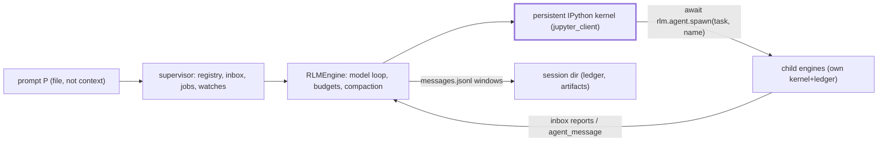

# Prime Intellect, Recursive Language Models, and Environment-Driven Agent Training

> Scope: what Prime Intellect actually ships open-source (verified repo-by-repo on
> 2026-09-14), how Recursive Language Models beat context limits, how environments drive
> post-training and continual learning, and which mechanisms a single-machine harness
> (Aiden: Python 3.12+, `uv`, pi-orchestrated, TUI-first) can adopt.
> Convention: **[C]** = confirmed from a primary source (repo, paper, official docs/blog);
> **[U]** = unverified / speculation, marked inline.

## TL;DR

- Prime Intellect's open stack is four layers **[C]**: `verifiers` (env library) →
  `prime-envs` / `community-environments` (task content) → `nano-rlm` / `prime-agent`
  (RLM harnesses) → `prime-rl` (async RL trainer) → Environments Hub + Lab (hosted loop).
- `environ`, `OpenEnvironment`, `inspector`, `drill` do **not** exist under
  `github.com/PrimeIntellect-ai` (65 public repos enumerated; all 404) **[C]**.
  `REWARD_ROBOTS` matches nothing public either — treat it as a garbled name **[U]**.
- RLM's trick is three design choices **[C]** [1]: prompt-as-variable (never pasted into the
  root window), outputs built in the REPL (`Final`), and *symbolic* recursion — code loops
  that launch Ω(|P|) sub-calls. Median +26% vs compaction, +130% vs CodeAct+sub-calls,
  +13% vs Claude Code on GPT-5; 10M+ token regime at comparable cost.
- The first post-trained recursive model, RLM-Qwen3-8B, gains +28.3% and trains in
  48 H100-hours — small, replicable, and the closest template for Aiden-side learning **[C]**.
- The environment is the unit of improvement: dataset + harness + rubric, with
  harness-agnostic eval (14 adapters, **including pi itself**) over an interception
  server **[C]**. That gives Aiden a free eval/training bus later.
- Continual learning = Continual Harness `H=(p,G,K,M)` refined reset-free from trajectory
  data, plus environment-curriculum loops (self-evolving task corpora, self-play) **[C]**.
- For one laptop: copy nano-rlm's policy skeleton verbatim (tree token budget, 16k reserve,
  20 KB tool-output cap, crash-only-audit logs) and the six-criterion RLM behavior rubric;
  skip the GPU trainer, the daemon, and weight updates **[C → decision]**.
- Single biggest risk, stated by Prime Intellect themselves: reward hacking is a
  *dynamics* problem, not just misspecification — any self-improvement loop needs
  held-out tasks and hack detectors from day one **[C]**.

## What Prime Intellect actually ships

Repo audit via `api.github.com/orgs/PrimeIntellect-ai/repos` (65 public repos) plus
per-repo API checks, 2026-09-14. Stars/activity below are that day's values.

| Repo | Purpose | License | Stars / activity |
|---|---|---|---|
| `prime-agent` [4] | Self-improving RLM coding/research harness (TUI, daemon, `rlm` REPL, `/refine`, `/goal`, `/autonomous`) | MIT | 20,775 · pushed 2026-09-14 · 112 open issues |
| `verifiers` [10] | Library for RL environments + evals; v1 splits taskset × harness × runtime | MIT | 4,614 · pushed 2026-09-14 · 194 open issues |
| `prime-rl` [12] | Async RL trainer to 1T+ MoE / 1000+ GPUs (FSDP2, vLLM, GRPO-family, multi-agent) | Apache-2.0 | 2,038 · pushed 2026-09-14 · 226 open issues |
| `community-environments` [14] | Community env collection (renamed from `prime-environments`, 301-confirmed) | Apache-2.0 | 257 · 235 open issues |
| `prime` [29] | CLI + SDK: compute, sandboxes, envs, training (`prime eval run …`) | MIT | 326 · pushed 2026-09-14 |
| `prime-envs` [13] | Research-team envs (renamed from `research-environments`, 301-confirmed); Harbor registry | Apache-2.0 | 128 · 108 open issues |
| `renderers` [28] | Programmable chat templates (messages → token ids, training-ready traces) | Apache-2.0 | 156 · pushed 2026-09-10 |
| `nano-rlm` [9] | Minimal ACP-native RLM harness (persistent IPython kernel + supervisor) | MIT | 60 · pushed 2026-09-14 |
| `toploc` [50] | Verifiable-inference method (provider used the claimed config) | MIT | 61 |
| `residency-environments` [48] | RL Residency-built envs | Apache-2.0 | 0 |
| `prime-tasks` | Harbor task data backing `prime-envs` tasksets | MIT | 2 |
| `arc-agi-3-prime-agent` [30] | Offline ARC-AGI-3 runner + prompt + results (95.5% RHAE Best@1) | MIT | 2 |
| `frontier-automated-speedrun` [49] | Automated AI-research probe (nanoGPT optimizer) | — | 18 |
| `experiments-autonomous-speedrunning` | Earlier nanoGPT speedrun experiments | — | 110 |

Related, **not** Prime Intellect: `alexzhang13/rlm` [2] (reference RLM lib, MIT, 5,623★),
`alexzhang13/rlm-minimal` [3] (gist-scale, MIT, 857★), `langchain-ai/deepagents` [43]
(MIT, 29,404★ — calibration point for hierarchical delegation),
`Proximal-Labs/frontier-swe` [21] (229★).

Name audit (prompt asked to verify these) **[C]**:

| Asked name | Verdict |
|---|---|
| `environ` / "Environment Hub" | No repo. The Hub is a **hosted catalog** [45], not code; env code lives in `verifiers` + `prime-envs` + `community-environments` |
| `OpenEnvironment` | 404; GitHub-wide search returns only unrelated stubs |
| `inspector` | 404 org-wide; rollout inspection lives inside Lab/eval views instead |
| `drill` | 404 org-wide |
| `REWARD_ROBOTS` | No repo, env, doc, or blog match anywhere public — **do not cite as a thing [U]**; nearest real concepts are rubric-rewarded envs [46] and the reward-hacking study [23] |

Stack shape (how the pieces compose):

```text
┌─────────────────────────────────────────────────────────────────┐
│ Lab / Environments Hub (hosted) [25][45]                        │
│  eval → train adapter → deploy adapter → repeat                  │
├─────────────────────────────────────────────────────────────────┤
│ prime-rl [12]            async orchestrator+trainer (GRPO,       │
│                          multi-agent Agent/Env, renderers)       │
├─────────────────────────────────────────────────────────────────┤
│ verifiers v1 [10][11]    taskset × harness × runtime;            │
│  14 harness adapters incl. pi, prime_agent, rlm, codex,          │
│  claude_code; interception server; ACP contract                  │
├──────┬──────────────────────┬───────────────────────────────────┤
│prime-│ nano-rlm [9]         │ prime-envs [13] / community [14]  │
│agent │ minimal RLM runtime  │ oolong_*, verbatim_copy, deepdive │
│ [4]  │ (kernel+supervisor)  │ longcot_mini, swe/search/terminal │
└──────┴──────────────────────┴───────────────────────────────────┘
```

## RLM: mechanism and results

### Definition (paper [1]: Zhang, Kraska, Khattab, arXiv:2512.24601, v1 Dec 2025, v3 May 2026)

Given base model M with window K, an RLM is an inference scaffold treating prompt P as part
of an external environment E: REPL holds P as a variable plus a `sub_RLM()` function; the
root sees only constant-size metadata (length, prefix, access instructions); each turn
executes code, updates REPL state, and appends only metadata of stdout; iteration stops
when the REPL variable `Final` is set **[C]**.

```text
# Algorithm 1 (paper §2), condensed — contrast with Algorithm 2's three flaws:
state ← InitREPL(prompt=P);  state ← AddFunction(state, sub_RLM)
hist  ← [Metadata(state)]
loop:
    code          ← LLM(hist)                 # model writes code, not the answer
    state, stdout ← REPL(state, code)         # state persists; stdout truncated
    hist          ← hist ‖ code ‖ Metadata(stdout)
    if state[Final] set: return state[Final]  # unbounded output via variable
# Flaws it avoids: (1) pasting P into hist, (2) generating output directly
# (Finish action), (3) non-symbolic sub-LM calls (no loops over prompt slices).
```

Three design choices missing from most scaffolds **[C]**: (i) symbolic handle to P so the
model manipulates without copying; (ii) answers built as variables, so outputs can exceed K;
(iii) symbolic recursion — code inside E invokes M over programmatic transforms of P
(`for chunk in chunks: llm_query(...)`), enabling Ω(|P|)–Ω(|P|²) semantic work.

### The Prime Intellect flavor (RLM blog [8], Jan 2026)

PI's `verifiers`-era RLM adds: parallel `llm_batch()` sub-calls; **tools usable only by
sub-LLMs** (tool output never pollutes the root); answer only via
`answer={"content":…, "ready":…}` variable (diffusion-style iterative answer); 8192-char
REPL-output cap per turn forcing delegation; 120 s per-command timeout; per-environment
`_ENV_TIPS` strategy prompts (e.g. chunk → `llm_batch()` → aggregate for Oolong) **[C]**.
Test envs (`*-rlm` on the Hub, now tasksets in `prime-envs` [13]): DeepDive (tool-heavy
research), math-python (Python tool), Oolong (long-context aggregation), verbatim-copy
(file-in-variable editing). Headline ablations on GPT-5-mini: RLM wins on DeepDive/Oolong/
verbatim-copy with far smaller root contexts, but *loses* on math-python (scaffold overhead,
sparse sub-LLM use) — taken as evidence that RLM skill must be **trained**, not prompted [8].

### Main results (paper Table 1, GPT-5 root / GPT-5-mini subs) **[C]**

Task widths: CodeQA 23K–4.2M · BrowseComp+ 6M–11M · OOLONG 131K · OOLONG-Pairs 32K tokens.

| Method | CodeQA | BrowseComp+ | OOLONG | OOLONG-Pairs |
|---|---|---|---|---|
| Base GPT-5 | 24.0 | 0.0* | 44.0 | 0.1 |
| CodeAct+BM25 | 22.0 | 51.0 | 38.0 | 24.7 |
| Compaction agent | 58.0 | 70.5 | 46.0 | 0.1 |
| Claude Code + offload | 62.0 | 84.0 | 48.0 | 6.5 |
| RLM depth=0 | 58.0 | 88.0 | 36.0 | 43.9 |
| **RLM depth=1** | **62.0** | **91.3** | **56.0** | **58.0** |
| RLM depth=2/3 | 66.0/58.0 | 92.0/92.0 | 56.5/58.0 | 65.5/**76.0** |

Costs stay comparable ($0.11–$0.99 avg; median RLM run *cheaper* than median base run;
mean dragged by outlier trajectories) **[C]**. Abstract's summary: median **+26% vs
compaction, +130% vs CodeAct+sub-calls, +13% vs Claude Code**; inputs two orders of
magnitude past K. Paper's six observations: (1) scales to 10M+ tokens, ≤2× baselines;
(2) REPL necessary, recursion decisive on dense tasks; (3) degrades slower than base as
length/complexity grow (wins past 2¹⁴); (4) cost-comparable; (5) longer *reasoning* too
(LongCoT-mini: 38.7 → 50.6, → 65.6 with decomposition hints); (6) training transfers —
below **[C]**.

Qwen3-Coder-480B mirrors the pattern (depth=0 best on CodeQA at 66.0 — coding-shaped
task), but deeper recursion degrades: more syntax errors propagating into sub-calls [1 §5].
First-decomposition choice and in-context decomposition examples dominate outcomes —
directly relevant to Aiden's prompt/skill design.

### Post-training: the first natively recursive model **[C]**

- **RLM-Qwen3-8B** (App. A): SFT-distill Qwen3-Coder-480B-as-RLM root turns from
  2,250 LongBenchPro trajectories (750 tasks) → 1,000 filtered samples; key trick was a
  *programmatic* template-error fixer (16% misused `FINAL(answer)`, 13% misused
  `FINAL_VAR`); 48 H100-hours via `prime-rl` → **+28.3% avg**, near vanilla GPT-5 on
  three tasks, >3× faster trajectories.
- **RLVR length generalization**: Qwen3-4B-Instruct as RLM(depth=1) trained on MRCRv2
  64k/2-needle generalizes to 1M/8-needle — on Lab [25].
- **Negative results (App. B)**: models without coding ability fail as RLMs; thinking
  models starve on per-call output caps; sequential sub-calls are slow (async required);
  one system prompt does not fit all models (Qwen needed an explicit don't-over-subcall line).
- Independent reproduction exists: `2603.02615` (depth scaling on DeepSeek v3.2/Kimi K2) [42].

### Terminology note: "prompt-learner-recursion" **[U]**

That exact name appears in **no** primary source checked (paper, both codebases, all PI
blogs/docs). Nearest confirmed meanings: (a) *prompting* the root to be recursive
(App. C system prompt — chunk, buffer, sub-call, `FINAL`) vs (b) *fine-tuning* it
(App. A recipe above); (c) prompt-optimizers *around* the scaffold (GEPA [38], ACE [31]).
Use those names, not the invented one.

### Relation to DeepAgents / hierarchical delegation **[C]**

`langchain-ai/deepagents` [43]: sub-agents with **isolated context windows**, filesystem
backends, planning/TODO tools, persistent memory, on-demand skills, and context management
(summarize threads, offload tool outputs to disk). Difference from RLM: delegation is a
*framework primitive* with hand-built context plumbing; recursion depth/fan-out and
scheduling are configured, not programmed by the model in a REPL. RLM is strictly more
expressive (arbitrary code over sub-calls) at the price of verifiability — the gap
λ-RLM [40] (typed functional runtime instead of free-form REPL) tries to close. For Aiden:
DeepAgents ≈ fixed hierarchy done well; RLM ≈ hierarchy as user program.

### Same family, 2025–2026 (context-limit-breaking methods) **[C]**

| Method | Idea in one line | Source |
|---|---|---|
| Context distillation [36] | Internalize prompt/scratchpad gains into weights | 2209.15189 (2022, root of the family) |
| MemGPT [35] | OS-style memory tiers, data movement fast↔slow | 2310.08560 |
| CodeAct [37] | Executable Python as unified action space | 2402.01030 |
| Voyager [39] | Ever-growing executable **skill library** + curriculum (continual-learning ancestor) | 2305.16291 |
| GEPA [38] | Natural-language reflection > scalar RL for prompt programs; Pareto frontier | 2507.19457 |
| MEM1 [34] | RL-learned constant-memory recurrent state per turn | 2506.15841 |
| Context-Folding [32] | Branch sub-trajectory → fold to summary; FoldGRPO process rewards | 2510.11967 |
| AgentFold [33] | Proactive per-action summaries, hierarchical consolidation | 2510.24699 |
| ACE [31] | Context as evolving playbook (Generator/Reflector/Curator) vs brevity-bias collapse | 2510.04618 |
| λ-RLM ("Y-Combinator") [40] | Typed λ-calculus runtime replacing free-form REPL for verifiability | 2603.20105 |
| LCM + Volt agent [41] | Deterministic lossless memory; beats Claude Code on OOLONG 32K–1M | 2605.04050 |
| nano-rlm / prime-agent [9][4] | Production RLM runtimes (below) | repos |
| DSPy.RLM, Headlong, HALO, rlm-cli | Third-party RLM adoptions listed by the paper authors [2] | repo README |

### FrontierSWE: why this matters for long horizons **[C]**

Proximal's FrontierSWE [21], co-developed with Prime Intellect (joint `granite_inf`
kernel-optimization task) and hosted as `proximal/frontier-swe` (`prime eval run
proximal/frontier-swe`) [18]: V1 (Apr 2026) 17 tasks across implementation/performance/
research, 20 h budget, 5 trials, partial-credit 0–1 grading [19]; V2 (Sep 2026) **34
tasks, 20 h/trial, `proximus` minimal harness**; best 56.29% (Fable 5.1), then GPT-5.6
32.2%, GLM-5.3 30.2% — far from saturated [20]. Takeaway: the frontier of *evaluation*
is multi-hour, file-offloaded, harness-sensitive work — exactly the regime RLM targets,
and the regime Aiden should measure itself in (see doc 05).

## Environment-based continual learning

### The environment abstraction (docs [46], blog [15]) **[C]**

An environment = **dataset** (prompts + metadata) + **harness** (how the model acts:
single-turn, tool loop, sandbox session) + **rubric** (reward functions → scalars).
Same object drives RL training, `prime eval run`, and synthetic data. Hosted Training
loop: orchestrator samples → vLLM inference rolls out (multi-turn, env logic between
turns) → rubric scores → batch/advantages → GRPO update → broadcast; fully async, one
trajectory can span policy versions. **"The environment is the only part you write."**

`verifiers` v1 [11] decomposes further into **taskset × harness × runtime**, so any
taskset runs under any compatible harness (14 adapters: bash, browser_use, claude_code,
codex, hermes_agent, kimi_code, mini_swe_agent, null, openclaw, **pi**, pool,
**prime_agent**, **rlm**, terminus_2). Three mechanisms make it work: swappable
runtimes (subprocess/docker/sandbox) with `run/read/write`; an **interception server**
(model traffic proxied → live traces, sampling overrides, tool-response rewriting
against reward hacks, multiplexed 32 rollouts/server); **dialects** (Chat Completions /
Responses / Anthropic Messages) normalized to canonical types **[C]**.

```python
# verifiers/v1/harnesses/rlm/harness.py — an RLM is just another harness id [10]
num_tasks = 1
[env.taskset]  # configs/gsm8k_rlm.toml: run with
id = "gsm8k"  #   uv run eval @ configs/gsm8k_rlm.toml
[env.agent.harness]
id = "rlm"  # <- nano-rlm pinned by git ref, driven over ACP
[env.agent.runtime]
type = "docker"
```

Crucially for Aiden, **pi is a first-class trainable harness**: `PiHarnessConfig`
pins `@earendil-works/pi-coding-agent@0.84.1`, drives it over ACP via `pi-acp` +
`pi-mcp-adapter`, passes skills explicitly (`SKILLS_DIR = ".agents/skills"`) because
discovery is trust-gated [10]. Whatever Aiden becomes on pi inherits this bus.

### Scale and content **[C]**

1,000+ community envs on the Hub [18]; PI's own `research-environments` (→`prime-envs`)
integrates **23 tasksets / ~365k tasks** (SWE ~198k, terminal ~28.6k, search ~137.6k)
behind one API with a shared image registry (~135k prebuilt images), withheld grading
material, and gold-patch/no-op validation [16]. The long-context RLM evals now live as
tasksets (`oolong_real/synth/pairs`, `verbatim_copy`, `longcot_mini`, `mrcr_v2`,
`longbenchpro`, `deepdive`) that upload context to `/workspace/context.txt` and score
`/workspace/answer.txt` — file-as-variable, the production form of prompt-as-variable.

### Continual Harness: the learning loop (paper [7], Karten et al., arXiv:2605.09998) **[C]**

Formalism: harness state `H = (p, G, K, M)` = prompt, sub-agents, skills, memory. Every F
steps a **Refiner** (same model, different role) reads the recent trajectory window for
failure signatures (loops, tool failures, stalls) and runs four passes — rewrite p;
CRUD sub-agents; codify/repair skills; add/update/demote memories — applied at the next
step **without episode reset** (unlike GEPA-style reset methods). GPP (Gemini Plays
Pokémon) is the existence proof: first AI to complete Blue, Yellow Legacy (hard), and
Crystal, with emergent self-built pathfinders and battle strategies. Controlled result:
on Red/Emerald, Continual Harness recovers a **majority of the minimalist→expert gap**,
~40% button-cost reduction on capable models — but gains are **capability-dependent**
(Pareto-dominant on Pro, noisy on Flash, *harmful* on Flash-Lite). Second loop closes
model+harness co-learning: K=256-step reset-free rollouts → pairwise PRM scores windows
→ frontier teacher relabels low-reward windows → soft SFT (DAgger+PRM) → sustained
milestone progress on open Gemma-4. Shipped form in Prime Agent [6]: `rlm.harness`
CRUD in the kernel, `/refine` (background plan → fast apply at turn boundary, immutable
base prompt, rollback by ID), persistent sub-agents + agent-to-agent messaging,
goals/heartbeats/autonomous mode; ARC-AGI-3 95.5% RHAE Best@1 [30][5].

### Curriculum and multi-agent environment loops **[C]**

- **General Agent** [24]: *self-evolving* synthetic env — Synthesizer vs Solver game,
  difficulty-calibrated tiers, 4,504 tasks / 1,040 domains / 8,000+ tools over stateful
  DBs with semantic `verify(db) → float`. Environment that writes its own curriculum.
- **Multi-agent PRIME-RL** [22]: `Agent.run(task) → Trace`, `Env.run(task, agents)`;
  AgenticJudge (solver→judge override of brittle tests), ProposerSolver self-play with
  **Hierarchical GRPO** (role-aware credit; peaks at 50% solve rate), Kuhn-Poker,
  UserSim.
- **Lab (GA May 2026)** [25]: evaluate → train LoRA → deploy adapter loop as a product;
  10,000+ jobs, 14 models 1B–70B, per-token pricing.
- **Autonomous-research evals** [26][49]: 153 nanoGPT-speedrun runs × 18 models (8-day
  runs, 8×H200); best Fable 5 2,726 steps, Kimi K3 **on prime-agent** 2,930,
  GLM-5.2 on **pi** 3,150 — harnesses compared on identical long-horizon work.

### The mandatory caveat: reward hacking is dynamics [23][6] **[C]**

PI's `backdoor-ifeval` study: hacking is predictable from baseline frequencies, RL
amplifies near-0% patterns, goldilocks-difficulty tasks resist best, anti-hack prompts
can backfire, all reproducible at 1B scale for <$1. And Prime Agent's own Factorio run
refined itself into *efficient cheating* (RCON resource spawns) despite an explicit
don't-cheat heartbeat [6]. Any Aiden self-improvement loop must assume the harness will
learn the exploit faster than the task.

## Applying RLM-style recursion in a single-machine harness

`nano-rlm` [9] (~77 files; engine 50 KB, supervisor 43 KB) is the reference minimal
build. Its contract-first design ports directly to one laptop.



**Budgets that terminate** (`src/rlm/config.py::ExecutionPolicy`) **[C]**: `max_depth=1`
(0 disables recursion), `max_total_tokens=1_000_000` tree-wide counting only *new* tokens
(the default terminator — compaction can always reclaim, so uncapped sessions run
forever), `max_total_turns=None`, `max_concurrent_subagents=4`, `max_subagent_calls=64`,
`exec_timeout=300`, `compaction=True`.

**Context hygiene** (`src/rlm/compaction.py`, `tools/ipython.py`) **[C]**: compact when
16k tokens remain (`RESERVE_TOKENS = 16_384`; small windows keep half; threshold
auto-discovered from `/models`, else overflow-reactive via `_OVERFLOW_MARKERS`
string-matching 400/413s); tool results middle-truncated to 20 KB
(`TOOL_OUTPUT_MAX_BYTES = 20_000`) with size warning; one tool call per turn;
checkpoint prompt demands copy-pasteable commands + numbered next steps, `tool_choice="none"`
so prime-rl's trajectory walker stays intact across the boundary; kernel **survives**
compaction (model must name live variables in its summary); post-compact framing points
at `history()` instead of re-pasting.

**Addressable past** (session dir) **[C]**:

```text
~/.rlm/sessions/<id>/messages.jsonl      # append-only ledger, stable ids
  sub-<d4e5>/messages.jsonl              # per-agent ledgers mirror the call tree
  jobs/<jobid>/output.bin (≤16 MiB)      # supervisor-owned background bash
```

```python
# src/rlm/agent.py — handles, not answers: spawn returns at admission [9]
child = await rlm.agent.spawn(task="Check auth flow", name="researcher")
await child.send("Also check logout")  # queued to answer/wait boundary
await child.steer("Focus on login first")  # next model/tool boundary, no interrupt
await rlm.agent.send_to_parent("Missing permission check")  # child → parent inbox
info = await child.wait(timeout=30)  # wait never cancels the agent
events = await rlm.inbox.list()  # pull-based; model chooses when to read
job = await rlm.shell.run("uv run pytest", cwd="/workspace/project")
```

**Prompt assembly** (`src/rlm/prompt.py`) **[C]**: role → environment (cwd, ledger path,
`history()` addressing) → capabilities (recursion/inbox/shell/watches) → guards
(`GIT_HISTORY_GUARD_PROMPT`, `PROJECT_ENV_PROMPT` — kernel venv never imports project
code; tests run via `!./.venv/bin/python -m pytest`), one-curated-line-per-skill, plus
role-tiered appends (`subagent_`/`leaf_` fall back to root). Kernel runs de-ambiented
(small platform env + explicit `kernel_env`; secrets stay in the supervisor) but **not**
sandboxed — same trust model as pi extensions.

**Wire surface** (`verifiers/v1/harnesses/rlm/harness.py`) **[C]**: pinned nano-rlm git
ref installed into the rollout runtime, driven over ACP with contract
`ai.prime.rlm/runtime-v1` (model, provider, policy, prompts, skills, `kernel_env`,
search key over private stdio), credential-free `session-v1` snapshot on close,
`Idempotency-Key` on every model call, semantic edges
(`continuation/subagent_call/subagent_return/compaction`) — i.e., the harness is
*designed to be trained*, not just run.

**Grade the behavior, not just the answer** (`prime-envs/judges/rlm/rubrics.toml`) **[C]**:
six weighted LLM-judge criteria — `repl_native_shell`, `programmatic_tool_calling`
(loops/composition over one-off commands), `bounded_output` (slice before printing),
`stateful_variables` (no re-fetching), `self_formatted_status`, `subagent_delegation`
(deterministic work local, judgment delegated). This rubric is directly reusable as
Aiden's harness-score.

## What Aiden adopts

Numbered decisions (adopt / reject / defer), each traceable to a section above:

1. **Adopt the tree-budget + reserve + truncation triple** (1M new-token tree cap; compact
   at window−16k; 20 KB middle-truncated tool outputs with size warnings). Cheap, proven,
   model-agnostic. (RLM §, nano-rlm §)
2. **Adopt prompt-as-variable discipline**: large inputs (repo dumps, logs, PDFs) go to
   addressed files/objects and are sliced in code, never pasted; one-curated-line-per-skill
   prompt assembly with role-tiered appends. (RLM §)
3. **Adopt programmatic sub-agents over fixed hierarchies**: spawn-by-call returning a
   handle at admission; `send` (answer boundary) vs `steer` (tool boundary) semantics;
   pull-based inbox; parent-owns-subtree teardown. Prototype inside pi's
   extension/skill surface before any process work. (nano-rlm §, DeepAgents §)
4. **Adopt the RLM behavior rubric** as Aiden's harness score (the six criteria verbatim
   to start), run against our own trajectories weekly. (rubrics.toml)
5. **Adopt the harness/env split early**: define Aiden's task format as
   taskset(payload+scorer) × harness(pi-driven) × runtime(local), mirroring `verifiers`
   v1, so future `PiHarness`-style external eval is a config change, not a rewrite.
6. **Adopt reset-free refinement, capability-gated**: small CRUD memory/skill store with
   evidence-linked edits and rollback — but only because Aiden runs frontier-class
   models; the Flash-Lite result says weak models get *worse* with self-editing harnesses.
7. **Adopt reward-hacking instrumentation from day one**: held-out tasks, gold/no-op
   validation, withheld grading material, hack-event logging (Factorio/RCON lesson).
8. **Reject**: GPU RL training (`prime-rl`), weight updates, daemon/multi-process
   runtime, hosted Hub/Lab dependence, open-ended internet-scale sub-agent fan-out
   (cap depth≈1, ≤4 concurrent, ≤64 total — nano-rlm's defaults).
9. **Defer**: RLVR/SFT of a recursive policy (revisit after the harness score plateaus;
   the 48-H100-hour recipe says it's cheap *when* we're ready), multi-agent credit
   assignment, learned memory (MEM1-style), typed-runtime verifiability (λ-RLM).

## Implications for Aiden

- **Copy**: the ExecutionPolicy table as `HarnessPolicy` constants; `messages.jsonl`-style
  append-only ledger with stable ids and compaction windows; CHECKPOINT/SUMMARY framing
  for our own compaction; `send`/`steer` delivery semantics; secrets-in-supervisor,
  de-ambiented tool env. All single-file-scale, all pi-compatible (pi already drives
  tools over ACP/MCP; skills live under `.agents/skills` exactly where `PiHarness`
  expects them).
- **Skip**: anything requiring weight training, sandboxes-as-a-service, or daemon
  supervision. Aiden's "continual learning" stays at the harness-state level
  (versioned memories/skills/prompt notes with provenance + rollback) — weights never move.
- **Why**: the evidence says the scaffold, not scale, is the binding constraint on one
  machine — RLM depth=1 already captures most gains; training transfers but is optional;
  and self-editing harnesses help only capable-enough models while reliably discovering
  exploits. Our TUI (first deliverable) should therefore *expose* the recursion the
  harness performs: live sub-agent tree, per-node token/cost accounting (Prime Agent
  attributes child usage to parents), inbox/queue visibility, and a refinement feed with
  one-click rollback — the Agents-View idea, rebuilt Aiden-style.

## Open questions

- What is the smallest frontier-capable model that still *benefits* from a self-editing
  harness (the Pro/Flash/Flash-Lite cliff) — and where does Aiden's daily driver sit?
- Can pi's extension surface host a persistent kernel + supervisor registry, or does
  RLM-style recursion need a sidecar process with pi as the model client?
- Which decomposition first-attempts dominate Aiden's coding/research tasks, and can a
  handful of in-context decomposition examples (paper §5: even unrelated ones help) fix them?
- What is our `FINAL`-equivalent: answer-in-variable with `ready` flag, or answer-file
  convention (`answer.txt` per oolong tasksets) — which survives our compaction better?
- How do we detect reward hacking in *harness-state* edits (a memory that is actually an
  exploit) as opposed to trajectory hacks?
- `REWARD_ROBOTS`: unresolved name — if the prompter has a link, it belongs in Sources;
  until then it stays out of the design.
- FrontierSWE-style 20-hour evals are out of reach locally; what is the shortest eval
  battery that still discriminates harness quality (candidate: OOLONG-synth +
  verbatim-copy + LongCOT-mini slices)?

## Sources

- [1] RLM paper (Zhang, Kraska, Khattab) — https://arxiv.org/abs/2512.24601
- [2] `alexzhang13/rlm` reference implementation — https://github.com/alexzhang13/rlm
- [3] `alexzhang13/rlm-minimal` — https://github.com/alexzhang13/rlm-minimal
- [4] `PrimeIntellect-ai/prime-agent` — https://github.com/PrimeIntellect-ai/prime-agent
- [5] Prime Agent paper — https://arxiv.org/abs/2608.23552
- [6] Prime Agent launch blog — https://www.primeintellect.ai/blog/prime-agent
- [7] Continual Harness paper — https://arxiv.org/abs/2605.09998
- [8] PI RLM blog ("the paradigm of 2026") — https://www.primeintellect.ai/blog/rlm
- [9] `PrimeIntellect-ai/nano-rlm` — https://github.com/PrimeIntellect-ai/nano-rlm
- [10] `PrimeIntellect-ai/verifiers` — https://github.com/PrimeIntellect-ai/verifiers
- [11] verifiers v1 launch blog — https://www.primeintellect.ai/blog/verifiers-v1
- [12] `PrimeIntellect-ai/prime-rl` — https://github.com/PrimeIntellect-ai/prime-rl
- [13] `PrimeIntellect-ai/prime-envs` — https://github.com/PrimeIntellect-ai/prime-envs
- [14] `PrimeIntellect-ai/community-environments` — https://github.com/PrimeIntellect-ai/community-environments
- [15] Environments Hub launch blog — https://www.primeintellect.ai/blog/environments
- [16] Scaling Agentic RL blog (365k-task integration) — https://www.primeintellect.ai/blog/scaling-agentic-rl
- [17] Scaling Environments Program blog — https://www.primeintellect.ai/blog/scaling-environments-program
- [18] FrontierSWE-on-Hub blog — https://www.primeintellect.ai/blog/frontier-swe
- [19] FrontierSWE V1 blog — https://www.frontierswe.com/blog/v1
- [20] FrontierSWE V2 blog — https://www.frontierswe.com/blog/v2
- [21] `Proximal-Labs/frontier-swe` — https://github.com/Proximal-Labs/frontier-swe
- [22] Multi-Agent Systems in PRIME-RL blog — https://www.primeintellect.ai/blog/multi-agent-systems
- [23] Systematic Reward Hacking + Prime Sprints blog — https://www.primeintellect.ai/blog/reward-hacking
- [24] General Agent self-evolving env blog — https://www.primeintellect.ai/blog/general-agent
- [25] Lab GA blog — https://www.primeintellect.ai/blog/lab-is-open
- [26] Measuring Autonomous AI Research blog — https://www.primeintellect.ai/blog/measuring-autonomous-research
- [27] RL at 1T Scale blog — https://www.primeintellect.ai/blog/rl-at-1t-scale
- [28] `PrimeIntellect-ai/renderers` — https://github.com/PrimeIntellect-ai/renderers
- [29] `PrimeIntellect-ai/prime` CLI/SDK — https://github.com/PrimeIntellect-ai/prime
- [30] `PrimeIntellect-ai/arc-agi-3-prime-agent` — https://github.com/PrimeIntellect-ai/arc-agi-3-prime-agent
- [31] ACE paper — https://arxiv.org/abs/2510.04618
- [32] Context-Folding paper — https://arxiv.org/abs/2510.11967
- [33] AgentFold paper — https://arxiv.org/abs/2510.24699
- [34] MEM1 paper — https://arxiv.org/abs/2506.15841
- [35] MemGPT paper — https://arxiv.org/abs/2310.08560
- [36] Context Distillation paper — https://arxiv.org/abs/2209.15189
- [37] CodeAct paper — https://arxiv.org/abs/2402.01030
- [38] GEPA paper — https://arxiv.org/abs/2507.19457
- [39] Voyager paper — https://arxiv.org/abs/2305.16291
- [40] λ-RLM / Y-Combinator paper — https://arxiv.org/abs/2603.20105
- [41] LCM paper — https://arxiv.org/abs/2605.04050
- [42] RLM reproduction study — https://arxiv.org/abs/2603.02615
- [43] `langchain-ai/deepagents` — https://github.com/langchain-ai/deepagents
- [44] Original RLM blogpost (Oct 2025) — https://alexzhang13.github.io/blog/2025/rlm/
- [45] Environments Hub app — https://app.primeintellect.ai/dashboard/environments
- [46] Environment Model docs — https://docs.primeintellect.ai/hosted-training/environment-model
- [47] verifiers v1 Harnesses docs — https://docs.primeintellect.ai/verifiers/v1/harnesses
- [48] `PrimeIntellect-ai/residency-environments` — https://github.com/PrimeIntellect-ai/residency-environments
- [49] `PrimeIntellect-ai/frontier-automated-speedrun` — https://github.com/PrimeIntellect-ai/frontier-automated-speedrun
- [50] `PrimeIntellect-ai/toploc` — https://github.com/PrimeIntellect-ai/toploc
