# Benchmarks & Evaluation for Coding Agents

How the field measures agentic coding, how an eval harness actually works at the
mechanism level, and how Aiden gets a cheap private eval loop that gates its own
self-updates. Everything below is verified against primary sources (repos, official
docs, papers) fetched 2026-09-15; versions and scores are as-published.

## TL;DR

- **Pick the axis first.** Every published number is (model × harness × benchmark ×
  infrastructure). Two of those four are usually undocumented. The SWE-bench site
  publishes a separate **"bash only"** leaderboard precisely because mixing harnesses
  makes model comparison meaningless [3].
- **Harness deltas are bigger than leaderboard gaps.** LangChain moved `deepagents-cli`
  from **52.8 % → 66.5 % on Terminal-Bench 2.0 with the model fixed** (+13.7 pts) by
  changing prompt, tools and middleware only [21]. Anthropic measured **±6 pts** from
  *infrastructure resource config alone* on TB 2.0 [20].
- **Therefore: treat <3 pts as noise.** Anthropic's explicit recommendation is
  skepticism below 3 percentage points until eval configuration is documented and
  matched [20].
- **Reproduce SWE-bench Verified locally in ~6 commands** (`uv add swebench mini-swe-agent`
  → `swebench eval verified --gold` → your harness → `swebench eval verified -p preds.jsonl`).
  On Apple Silicon you must add `--task-repo ./swe-bench-tasks` so images build locally;
  the registry images are `--platform=linux/amd64` [1][10]. Full recipe below.
- **Resolution detection is test-list diffing, not "did it work".** `FAIL_TO_PASS` +
  `PASS_TO_PASS` parsed out of raw test logs by a framework-specific parser; a patch
  that fixes the bug but breaks 1 of 300 previously-passing tests is `RESOLVED_NO` [1][10].
- **Contamination is now a design axis, not a footnote.** SWE-bench Pro sources GPL and
  *private commercial* repos; SWE-bench-Live re-mines fresh issues; Commit0 asks for
  from-scratch libraries; Terminal-Bench 4.0 removed 2 tasks for "public solutions"
  [5][8][16][27]. And agents *actively look for the answer*: HAL's log inspection found
  agents searching HuggingFace for the benchmark instead of solving the task [22].
- **Aiden's real eval is a private, repo-derived set.** FeatureBench proves the recipe:
  auto-derive feature-level tasks by tracing unit tests along a dependency graph —
  Claude 4.5 Opus: **74.4 % on SWE-bench, 11.0 % on FeatureBench** [26]. That gap is the
  entire argument for a private set.
- **Multi-turn is where personal harnesses die.** EvoCode-Bench: single-round score beats
  persistent (state-preserving) score by **22–40 points**; aggregate pass rate halves by
  round 5 [28]. Aiden is an iterative partner → our oracle must be stateful.
- **Tooling: Harbor for containerized agent benchmarks, Inspect for everything we
  author ourselves, OTel GenAI semconv as the trace format we write** so Braintrust /
  W&B / Langfuse stay swappable [18][29][30][31][32].

## Benchmark map

| Benchmark | Size (as published) | What an "answer" is | Oracle | Local run? | Notes / failure modes |
|---|---|---|---|---|---|
| **SWE-bench** (original) | 2,294 instances, 12 Python repos | git patch | `test_patch` + F2P/P2P pytest lists | yes | Python-only; unmaintained since 2023 [1][2] |
| **SWE-bench Lite** | 300 | patch | same | yes | Cheap subset for iteration [2] |
| **SWE-bench Verified** | 500, human-filtered | patch | per-instance Docker image + eval.sh | yes | Humans confirmed each task is solvable & test patch correct [4]; ~70 %+ for frontier models [5][11] |
| **SWE-bench bash-only** | same 500, fixed harness | patch from mini-SWE-agent | same | yes | *The* apples-to-apples model comparison; 1.x vs 2.x results **not comparable** (string-parsed vs tool-called actions; temperature 0.0 vs unset) [3][11] |
| **SWE-bench Multilingual** | 300 tasks, 42 repos, 9 languages | patch | per-language log parsers (go/php/ruby/rust/…) | yes | Cross-language generalisation, not Python-only [2][7] |
| **SWE-bench Multimodal** | 480 v2 tasks (visual issue assets) | patch + image assets | binary assets staged at eval time | yes | `image_assets` fetched/staged so baselines exist only during tests [1][9] |
| **SWE-bench Pro** | 1,865 = 731 public + 858 held-out + 276 commercial, 41 repos | patch | curated, avg **107.4 LOC / 4.1 files** | partially (public split) | GPT-5 23.3 %, Opus 4.1 23.1 % — vs >70 % on Verified. GPL + private code as contamination defence [5]. Later audit found **reward hacking via leaked gold solutions** and mis-scoped tests → *Pro Verified* [6] |
| **SWE-bench-Live** | 1,319 tasks from issues filed ≥2024, 93 repos | patch | auto-curated pipeline + per-task image | yes | Built to be re-mined continuously → contamination decays [8] |
| **SWE-rebench** | rolling refresh (`nebius/SWE-rebench`) | patch | same shape | yes | A continuously refreshed set mini can run directly (`--subset rebench`); also used as a training-data source [11] |
| **Terminal-Bench 2.0 / 2.1 / 3 / 4** | 89 tasks (2.0) [21]; 4.0 = 3.0 − 8 removed | terminal state | `tests/test.sh` → `/logs/verifier/reward.txt` | yes (Docker) or `-e modal/daytona` | Task-level `cpus`/`memory_mb`/`timeout_sec` are part of the *measurement*. TB 4.0: flat **8 h agent timeout**, 19 tasks fixed, 8 removed (2 saturated, 2 refusals, 2 public-solution, 2 platform) [16][18] |
| **mini-SWE-agent** (harness) | — | bash-only loop, ~100 lines | — | yes | Reference scaffold: `step_limit: 250`, `cost_limit: 3.`, 60 s per command, output elided at 10 k chars (5 k head + 5 k tail) [11] |
| **SWE-agent** (harness) | — | tools via ACI, `yaml` config | — | yes | Superseded by mini per its own README; keep it for ACI experiments [12] |
| **Aider polyglot** | 225 hardest Exercism problems, 6 langs | working code from a natural-language request | per-exercise unit tests | yes (Docker strongly advised) | Reports **both** pass rate and *% using correct edit format*; run with `--tries 2` → `pass_rate_1`/`pass_rate_2` [13][14][15] |
| **τ-bench / τ² / τ³** | per-domain (airline, retail, telecom, banking_knowledge) | final DB state + action trace | policy check, exact `evaluation_criteria.actions` | yes | Half-duplex text + full-duplex voice; **pass^k** = k independent trials must all pass. Versioning bites: `< 1.0.1` results are **not comparable** with `≥ 1.0.1` [23] |
| **GAIA** | 466 questions (300 private answers) | exact string | em-match | hosted | Humans 92 % vs GPT-4+plugins 15 % at release [24] |
| **GAIA2** | 800 scenarios (5 capabilities × 160) + mini 160 | write-actions verified | **write-action verifier** + judge | yes (ARE) | Asynchronous, event-driven world; `gaia2-run` forces **3 runs/scenario**; GPT-5 (high) 42 % pass@1, Kimi-K2 21 % [25] |
| **FeatureBench** | 200 tasks / 3,825 exec envs / 24 repos | multi-commit feature implementation | executable tests, auto-derived | yes | Model that hits 74.4 % on SWE-bench hits **11.0 %** here [26] |
| **Commit0** | Python libraries rebuilt from a spec document, from scratch | implementation from spec | upstream test suite | yes | Contamination-free by construction (nothing to memorise) [27] |
| **EvoCode-Bench** | 26 tasks / 227 evaluated rounds | code that survives 5–15 changing requirements | cumulative executable tests | yes (Harbor) | `MT@4` (fail-stop multi-round) vs `SR` (single round): gap 22–40 pts, ranks reshuffle [28] |
| **HAL** (meta-eval) | 21,730 rollouts, 9 models × 9 benchmarks, ≈$40 k, 2.5 B tokens | n/a | it *runs* other benchmarks | hosted | 3-D analysis (model × scaffold × benchmark); found higher reasoning effort **reduces** accuracy in the majority of runs [22] |
| **arena.ai (LMArena) Code / WebDev Arena** | 679,295 votes, 128 models (WebDev, 2026-09-11) | preference | human pairwise vote → rating | n/a | Cheap, continuous, ecologically valid; measures *perceived* quality. Style-controlled variants exist to strip formatting bias [33] |

**Adjacent sets we looked at and are not treating as primary:** SWE-smith /
SWE-bench-Prime (synthetic task + RL env generation), `SWE-bench_Not_Verified` (the
instances humans rejected — useful as negatives), DeepSWE, ProgramBench, CodeClash
(SWE-smith / SWE-prime live in the `SWE-bench` HF org [1]; the rest ship as mini reference projects [11]).

## Anatomy of an eval run

```mermaid
flowchart LR
  A[Dataset instance<br/>instance_id, repo, base_commit,<br/>problem_statement, test_patch,<br/>FAIL_TO_PASS, PASS_TO_PASS, image] --> B[Environment<br/>pull or build Docker image<br/>/testbed @ base_commit]
  B --> C{Model side<br/>harness runs agent}
  C -->|patch text| D[preds.jsonl<br/>instance_id, model_name_or_path, model_patch]
  C -->|trajectory| T[traj.json / ATIF<br/>steps, tool calls, metrics, cost]
  D --> E[Reset env<br/>git checkout -- . ; git clean -fd]
  E --> F[Apply model patch<br/>git apply → 3way → --reject → patch --fuzz=5]
  F -->|fail| X[APPLY_PATCH_FAIL<br/>counts as unresolved + error]
  F -->|ok| G[Apply test_patch<br/>install repo, stage binary assets]
  G --> H[Run selected tests only<br/>>> Start Test Output ... >>> End Test Output]
  H --> I[Log parser → per-test status map<br/>PASSED/FAILED/SKIPPED/ERROR/XFAIL]
  I --> J[Grade: all F2P pass AND all P2P pass<br/>=> resolved]
  J --> K[results.json per run<br/>+ report.json per instance]
  T --> L[Cost, tokens, turns,<br/>infra-failure triage]
```



The two halves — **inference** (agent writes a patch) and **evaluation** (tests decide) —
are deliberately separated. SWE-bench ships them as two CLIs: `swebench infer …` and
`swebench eval …`, and grades from a plain predictions file. That seam is what lets us
substitute our own harness without touching the oracle [1].

### What one task actually contains

`swe-bench-tasks`, the official task repo (`tasks/<instance_id>/`, 1,000 dirs for the
original three datasets) [10]:

```
tasks/sympy__sympy-20590/
├── task.yaml              # base_commit, environment_setup_commit, image,
│                          # repo, version, log_parser, eval_type, split, difficulty
├── Dockerfile             # FROM --platform=linux/amd64 ubuntu:jammy + miniconda + /testbed
├── environment.yml        # pinned conda env
├── problem_statement.md   # what the agent sees (issue text)
├── hints.md               # raw PR discussion — contains commit SHAs & PR numbers (leakage!)
├── test.patch             # the hidden tests
├── tests.json             # {"FAIL_TO_PASS": ["test_immutable"], "PASS_TO_PASS": [...]}
├── gold.patch             # reference solution (never shown to the agent)
└── eval.sh                # the executable oracle
```

`eval.sh` verbatim, condensed — this *is* "test selection + resolution detection" [10]:

```bash
#!/bin/bash
set -uxo pipefail
source /opt/miniconda3/bin/activate; conda activate testbed; cd /testbed
git -c core.fileMode=false diff <base_commit>          # sanity: env is clean
python -m pip install -e .                              # repo reinstalled after patch
git checkout <base_commit> sympy/core/tests/test_basic.py   # discard agent's test edits
git apply -v - <<'EOF_114329324912'                     # re-apply authoritative test patch
 ...
EOF_114329324912
: '>>>>> Start Test Output'
PYTHONWARNINGS='ignore::UserWarning,ignore::SyntaxWarning' bin/test -C --verbose sympy/core/tests/test_basic.py
: '>>>>> End Test Output'
git checkout <base_commit> sympy/core/tests/test_basic.py   # restore tree
```

Seven mechanics worth naming explicitly, because Aiden will need its own version of each:

1. **Per-task environments.** One immutable image per instance
   (`docker.io/swebench/sweb.eval.x86_64.<repo>_1776_<n>:latest`; the `_1776_` token
   replaces `__` because Docker forbids double underscores) [11]. Harbor's equivalent is
   `environment/Dockerfile` or a prebuilt `[environment].docker_image`, plus
   `[environment].cpus/memory_mb/storage_mb` and `[agent].timeout_sec` /
   `[verifier].timeout_sec` in `task.toml` [18]. Containers are created per trial,
   `tail -f /dev/null`, `cap_add=["SYS_ADMIN"]` (browser sandboxes need `CLONE_NEWUSER`)
   and removed after [1].
2. **Patch application is a ladder, not a command.** `swebench/harness/run_evaluation.py`:

   ```python
   GIT_APPLY_CMDS = [
       "git apply --verbose",
       "git apply --verbose --3way",
       "git apply --verbose --reject",
       "patch --batch --forward --fuzz=5 -p1 -i",
   ]
   ```
   Between attempts the harness runs `git checkout -- . ; git clean -fd` because a failed
   `--reject` leaves partial state that poisons every later command, and it finishes with
   `git apply --check --reverse` to catch the case where the chain actually applied the
   patch but every command exited non-zero [1]. Fuzzy application is *generous* — which is
   why "did the model write the right diff" and "did the tests pass" are different
   questions.
3. **Test selection.** Only the listed test files/functions run — the harness never runs
   a repo's whole suite. Selection is names, not semantics, so the grader is a string map
   built by a per-framework parser (`parse_log_pytest`, `parse_log_sympy`, `parse_log_rust`,
   `parse_log_eslint`, … in `swebench/harness/log_parsers/`) that turns raw stdout into
   `{test_name: status}` [1]. Parser bugs are real bugs: a `SKIPPED [3] path:line` summary
   line was being read as a test named `[3]`.
4. **Resolution detection.** `EvalType.PASS_AND_FAIL` → all `FAIL_TO_PASS` pass **and** all
   `PASS_TO_PASS` maintained; `FAIL_ONLY` (used for `eslint/eslint`, `openlayers`,
   `Chart.js`, `marked`, `p5.js`, `bpmn-js`) → only the newly-expected failures matter.
   Statuses: `RESOLVED_FULL`, `RESOLVED_PARTIAL`, `RESOLVED_NO` [1]. Because the answer
   lives in a log file, the harness also captures the test command's own exit code
   (`SWEBENCH_TEST_EXIT_CODE` echoed *after* the end marker, outside the parsed region)
   so a passing-looking log cannot hide a crashed runner [1]. **Regrading is cheap:**
   `swebench report <run_id> -d verified` re-parses saved `test_output.txt` with no
   containers [1].
5. **Timeouts, retries, and infra triage.** `--timeout 1800` per instance,
   `SWEBENCH_DOCKER_TIMEOUT=1800`, `SWEBENCH_DOCKER_POOL_SIZE=128` [1]. Terminal-Bench
   4.0 went to a flat 8 h agent timeout so frontier models essentially never time out —
   "reducing measurement noise" is stated as the reason [16]. Inspect separates
   `time_limit` (wall clock) from `working_limit`, which *excludes* rate-limit retries and
   waiting on shared resources (containers, subprocesses) — the right primitive, since a
   provider outage is not the agent's slowness [29]. SWE-bench's `infra_failure.py`
   classifies failures post-hoc from log signatures into `environment` (OOM, no display,
   docker daemon gone, DNS failure) vs `ambiguous` (`ModuleNotFoundError`, "no tests ran",
   timeout) — **advisory only, so the denominator never changes silently** [1].
6. **Seeds, repeats, variance.** Repeat counts appear everywhere: `harbor run -k 5`
   (attempts per task) and `-r <retries>` (infra retries) [18]; `tau2 run --num-trials N`
   scored with pass^k [23]; GAIA2's `gaia2-run` *forces* 3 runs/scenario for variance [25];
   aider `--tries 2` yields `pass_rate_1`/`pass_rate_2` [15]. Randomness is *not* seeded
   by these harnesses — the honest statement is "temperature and sampling are documented",
   and the SWE-bench bash-only config leaves temperature unset for mini 2.x [3].
7. **Cost tracking.** Every serious leaderboard now reports cost and tokens next to score
   (TB lists `RESOLUTION RATE | COST | TOKENS`; aider reports `total_cost` per run; SWE-bench
   bash-only runs cost ≈`$3`/instance by mini's default `cost_limit`). TB 4.0's own writeup
   is a cautionary tale about spending: one model burned **21.6 B tokens where another used
   6.5 B** on the same task set [16].

### Contamination and leakage channels

| Channel | Example in the wild | Mitigation seen |
|---|---|---|
| Pre-training memorisation | frontier models >70 % on Verified [5] | SWE-bench Pro: GPL + private commercial repos [5]; SWE-bench-Live re-mines fresh issues, and mini ships a rolling `rebench` subset, so staleness itself decays [8][11] |
| Solution in the prompt | `hints.md` carries upstream commit SHAs / PR numbers [10] | curate `problem_statement.md` separately from raw discussion |
| Answer reachable at runtime | agent has a shell and often network → `git fetch`, `pip download`, search HuggingFace | Harbor `network_mode = "allowlist"` + `allowed_hosts` [18]; mini sets no network policy by default |
| Test/hidden-info leakage | gold test files or verifier scripts readable in-env | TB ships `environment/protected.tar.gz.enc`; Pro Verified adds "anti-hacking safeguards"; Harbor can run the verifier in a **separate sandbox** [16][18] |
| Agent gaming the eval | HAL logs: searching HuggingFace for the benchmark instead of solving [22] | **Inspect Scanners** — LLM review of transcripts for eval awareness, reward hacking, refusals, misconfigured environments; `scout scan -T ./logs` [29] |
| Public solutions on the internet | TB 4.0 removed 2 tasks for exactly this [16] | prune, don't tolerate: benchmark-as-software with a changelog |
| Saturation | TB 4.0 removed 2 tasks solved 5/5 by every model family [16] | retire tasks once all classes solve them |

## Fair comparison: harness vs model

The confound is quantified, not hypothetical:

| Study | Fixed | Varied | Spread |
|---|---|---|---|
| LangChain, TB 2.0 [21] | model `gpt-5.2-codex` | system prompt, tools, middleware | 52.8 % → **66.5 %** (+13.7 pts) |
| Anthropic, TB 2.0 [20] | model + harness + task set | CPU/RAM enforcement (1× → uncapped) | **6 pts**, p<0.01; infra error rate 5.8 % → 0.5 % |
| Anthropic, SWE-bench [20] | same | RAM up to 5× (227 problems × 10 samples) | +1.54 pts |
| LangChain, same harness [21] | harness v_n | model | xhigh-only 53.9 % vs high 63.6 % — *timeouts*, not capability |
| HAL, 9 models × 9 benchmarks [22] | scaffold set | reasoning effort | higher effort **lower** accuracy in the majority of runs |
| mini vs SWE-agent [11][12] | model | 100-line bash loop vs full ACI | "nearly as well", at a fraction of the complexity |

Three rules fall out of that:

1. **Compare models with one frozen harness** (SWE-bench bash-only [3]), and **compare
   harnesses with one frozen model** (LangChain's method [21]). Never both.
2. **Publish the config as part of the result.** Harness version, prompt hash, tool set,
   limits (`step_limit`, `cost_limit`, timeouts), temperature policy, sandbox provider,
   CPU/RAM *guarantee and ceiling separately* — Anthropic's specific recommendation, since
   runtimes enforce a reservation and a kill threshold as two parameters and pinning them
   equal leaves zero headroom for transient spikes [20]. Harbor exposes exactly this:
   `cpu_enforcement_policy` / `memory_enforcement_policy` ∈ `auto|limit|request|guarantee|ignore` [18].
3. **Report the harness's own failure budget.** Above ~3× task-spec resources, extra
   compute starts solving tasks that were previously unsolvable — i.e. the *limit becomes
   part of the difficulty*, and "efficient agent" and "brute-force agent" score differently
   for legitimate reasons [20]. TB's leaderboard audits entries for correct configuration
   and publishes verified trajectories [16]; Harbor's leaderboard rows are
   agent×model pairs, and a mirror dataset is explicitly labelled *unofficial* [19].

Scaffolding also changes *what generalises*: Aiden's design choices should be tested by
running one harness across ≥2 models of different capability (mini's argument is that a
weak scaffold underestimates a strong model, and vice versa) [11][12].

## Local reproduction recipe

Goal: run **SWE-bench Verified (500)** with **our own** Python harness, graded by the
official oracle, on one machine. macOS/Apple Silicon notes inline.

```bash
# 0. Preconditions: Docker (or OrbStack/podman) with ≥120 GB free disk, 16 GB RAM, 8 cores.
docker info && docker system df

# 1. Env + deps (swebench 5.0.2 base deps already include docker, tenacity, unidiff, typer, modal)
cd project-aiden && uv add swebench mini-swe-agent datasets python-dotenv
uv run python -c "import swebench, mini_swe_agent" # sanity

# 2. Task repo (Dockerfile + eval.sh + tests.json per instance). Needed on ARM to BUILD images.
git clone --depth 1 https://github.com/SWE-bench/swe-bench-tasks.git ./swe-bench-tasks
uv run swebench dataset check ./swe-bench-tasks

# 3. Prove the oracle works before trusting any model number (gold patches).
#    ~1 image pull/build + test run per instance.
uv run swebench eval verified --gold -i sympy__sympy-20590 \
    --run-id validate-gold --task-repo ./swe-bench-tasks
uv run swebench report validate-gold -d verified      # expect resolved: 1/1

# 3b. Peek inside one env by hand before trusting anything automated:
docker run --rm -it docker.io/swebench/sweb.eval.x86_64.sympy_1776_sympy-20590:latest \
  bash -c 'cd /testbed && git log --oneline -3 && git status --short | head'
# (On ARM this pulls the amd64 image under emulation — slow but fine for a look.)

# 4. Reference upper bound with a stock harness (drop --task-repo on x86, keep it on ARM):
export ANTHROPIC_API_KEY=sk-ant-...
uv run swebench infer verified -m anthropic/claude-sonnet-4-5-20250929 \
    -o runs/mini-sonnet -w 8 -- --subset verified --split test
uv run swebench eval verified -p runs/mini-sonnet/preds.json \
    --run-id mini-sonnet -j 8 --task-repo ./swe-bench-tasks
```

`preds.json` is the only contract between harness and grader — either a list or an
`instance_id → pred` map (mini writes the dict form; SWE-agent writes a list; both parse) [1]:

```jsonl
{"instance_id":"sympy__sympy-20590","model_name_or_path":"aiden-v0","model_patch":"diff --git a/sympy/core/sympify.py b/sympy/core/sympify.py\n@@ ...\n"}
```

### 5. The custom harness (the part we actually own)

`aiden/eval/run_swebench.py` — reuse SWE-bench's own container plumbing (`make_test_spec`,
`docker_utils`) so environment drift can never be blamed on us. This is our code; the
imported names are real [1][11]:

```python
import json, docker
from pathlib import Path
from swebench.harness.utils import load_swebench_dataset, make_test_spec
from swebench.harness.docker_utils import cleanup_container, exec_run_with_timeout
from aiden.agent import Aiden  # our loop: model + tools + guardrails

client = docker.from_env(timeout=1800, max_pool_size=128)
out = Path("runs/aiden-v0")
out.mkdir(parents=True, exist_ok=True)
preds = json.loads((out / "preds.json").read_text()) if (out / "preds.json").exists() else {}

for inst in load_swebench_dataset("SWE-bench/SWE-bench_Verified", "test"):
    iid = inst["instance_id"]
    if iid in preds:  # resumable by construction
        continue
    spec = make_test_spec(inst)  # image + F2P/P2P + eval script
    c = client.containers.create(
        image=spec.image,
        user="root",
        detach=True,
        command="tail -f /dev/null",
        name=f"aiden.{iid}.{RUN_ID}",
    )
    c.start()
    try:
        # our agent works in /testbed; every action is one exec, so it is trivially sandboxed
        patch, traj = Aiden(
            model="anthropic/claude-sonnet-4-5-20250929",
            cost_limit_usd=3.0,
            step_limit=250,
            per_cmd_timeout=60,
        ).solve(c, inst["problem_statement"], workdir="/testbed")
        (out / f"{iid}.traj.json").write_text(json.dumps(traj))
        preds[iid] = {
            "instance_id": iid,
            "model_name_or_path": "aiden-v0",
            "model_patch": patch or "",
        }  # "" = empty patch, counted separately
    finally:
        cleanup_container(client, c, LOG)
    (out / "preds.json").write_text(json.dumps(preds, indent=2))
```

Then grade it: `uv run swebench eval verified -p runs/aiden-v0/preds.json --run-id aiden-v0 -j 4 --task-repo ./swe-bench-tasks`.

If you would rather not own the container code at all, swap only the *policy* layer: mini's
`--subset /path/to/your/dataset` accepts anything in SWE-bench format, and its
`environment_class` (local/docker/singularity/bubblewrap) is where the harness ends and the
environment begins [11].

### 6. Repeats, noise, and cost discipline

```bash
# k attempts per instance (different attempt index = different container name/run-id)
for k in 1 2 3; do
  uv run swebench eval verified -p runs/aiden-v0/preds.json --run-id aiden-v0-a$k -j 4
done
# report pass@1 (any attempt resolves) and pass^3 (all attempts resolve) per instance
```

Never reuse a `run_id` for new predictions: results cache on `(run_id, instance_id)` [1].

| Knob | Where | Default | Why you touch it |
|---|---|---|---|
| parallel instances | `-j/--workers`, `-n` (Harbor) | 4 | `≤ min(0.75·cores, 24)` [1] |
| per-instance test timeout | `-t/--timeout` | 1800 s | keep fixed across arms |
| docker client timeout / pool | `SWEBENCH_DOCKER_TIMEOUT`, `SWEBENCH_DOCKER_POOL_SIZE` | 1800 / 128 | hung pulls, socket exhaustion |
| image pull timeout | mini `environment.pull_timeout` | 120 s | "stuck at initializing task" = pulling |
| agent steps / cost | mini `agent.step_limit`, `cost_limit`; `MSWEA_GLOBAL_CALL_LIMIT`, `MSWEA_GLOBAL_COST_LIMIT` | 250 / \$3 | hard budget per task |
| per-command timeout | `environment.timeout` | 60 s | runaway test suites |
| CPU/RAM policy | Harbor `--cpus limit --memory guarantee` | per-task spec | the Anthropic confound [20] |
| egress | Harbor `[environment] network_mode="allowlist"`, `allowed_hosts` | open | kill the "search HuggingFace" cheat [18][22] |
| retries | Harbor `-r`, `include_exceptions`/`exclude_exceptions` | – | retry infra errors, never model errors [18] |
| cloud execution | `--modal true`, `-e modal\|daytona` | local docker | x86 speed, GPU tasks [1][16] |

### 7. Pitfalls, in the order we will hit them

- **ARM**: images are `FROM --platform=linux/amd64`; QEMU emulation makes some repos' test
  suites take 3–10×. Official position: `arm64` support is *experimental*; on M-series use
  `--task-repo` so Buildx builds locally [1][11]. Real answer: run the leaderboard-grade
  numbers on an x86 VM, use the Mac for smoke tests.
- **Disk**: 500 instance images ≈ 300–800 GB with layers. `swebench images clean --run-id …`,
  `docker image prune`, or build-your-own with `--cache_level base` [1].
- **Ghost containers**: a killed run leaves `sweb.eval.<iid>.<run_id>`; the harness removes
  name conflicts by suffixing a timestamp, so `docker ps -a` and prune manually [1].
- **Silent build failures**: without `--task-repo` a failed build falls back to the published
  image and can report a clean pass for a tree you never built — the code says this out loud [1].
- **Empty patches are skipped, not failed**: instances with `model_patch == ""` are filtered
  out of the run set and surface as "Instances incomplete" [1]. A crash in our harness must
  not masquerade as a model failure — write `""` *and* record it separately.
- **"40 ran successfully, 0 failed" ≠ clean**: that counts harness crashes; grading errors are
  "Instances with errors" with no `report.json`. Read that instance's `run_instance.log` [1].

## Aiden private eval set

Public leaderboards are for calibrating against the field. For *decisions* — did this
prompt/tool/skill change help? — we need a set derived from our own repos, cheap enough to
run on every self-update. Four components:

**1. Task miner (repo-derived).** FeatureBench's recipe is the one to copy: trace from unit
tests along a dependency graph to find feature-level changes spanning multiple commits, then
verify the remainder still works [26]. In our own repo the equivalent is simpler:

```
for each merged PR touching src/ with tests:
    base   = merge_commit^           # pre-fix tree
    tests  = tests added/changed     # → FAIL_TO_PASS candidates
    frozen = tests NOT touched, sampled N=50   # → PASS_TO_PASS
    prompt = PR description (issue body, NOT the diff)
    oracle = run pytest on the two lists inside a pinned container
```

Hold-out rule: only tasks whose `merge_date > last_model_cutoff_you_trust`, plus tasks
hand-written from *your* own bug reports — private by definition, therefore uncontaminated.
Aider's polyglot design is the same instinct applied to difficulty: keep only problems that
≤3 of 7 frontier models solved, so the metric has headroom [13].

**2. Oracle = unit tests first, judge second.** Prefer executable oracles (`test.sh` →
`reward.txt`/`reward.json` [18], or F2P/P2P lists [10]) for anything decidable. Use an LLM
judge only for style/process, keep it in a *separate* verifier sandbox with its own model
and cost budget, and pin its rubric — Harbor's RewardKit validates judge TOMLs and fails on
unknown keys, because a misspelled `[[criterion]]` used to make a whole judge silently
disappear [18]. Judge drift is a versioned thing, not a config detail.

**3. Regression gate for self-updates.** Aiden proposes patches to its own prompts/tools/skills.
Each proposal runs a three-stage gate:

```
stage 0  static        ruff + mypy + pytest unit tests            (~10 s)
stage 1  smoke eval    15 tasks × 1 attempt, same seed set         (~$1)
stage 2  full eval     all N tasks × 3 attempts, vs pinned baseline (~$10)
gate     promote only if: resolved_delta >= 0 AND cost_delta <= +15%
                        AND no new infra failures AND no scanner hits
```

`PASS_TO_PASS` for the harness itself: a fixed list of *behavioural* invariants (never
exceeds step budget, always writes a valid patch, never edits tests, asks permission before
`rm -rf`) graded by a cheap deterministic checker. τ-bench's lesson applies: **a small state
change flips a large outcome** — one wrong tool argument cascades through a whole session,
which is why SABER-style "small actions, big errors" guarding and exact action matching are
the oracle there [23]. Terminal-Bench's semver discipline is the thing to copy for our own
task set: **major = re-run** (env/task changes), **minor = re-grade** (verifier changes),
**patch = reuse** (metadata) [16]. If you cannot state the version, you cannot compare runs.

**4. Hygiene.** Turn egress off (`network_mode=allowlist`, only the model endpoint in
`allowed_hosts`); keep solutions out of the agent filesystem (TB's `protected.tar.gz.enc`
pattern [16]); make `tests/` land only at verify time (`/tests/`) [18]; and periodically run a
scanner over stored transcripts for eval awareness and reward hacking [22][29].

## Metrics we track

Report per run, always keyed by `(harness_version, model, benchmark_version, infra_profile)`:

| Class | Metric | Source of truth |
|---|---|---|
| Capability | resolved % (pass@1), pass^k over k attempts, partial-resolved %, F2P/P2P sub-rates | `report.json` + `tests_status` [1] |
| Capability | rounds-survived curve (multi-turn decay), per-language and per-repo breakdown | EvoCode's MT@4 vs SR; Pro's per-repo spread [5][28] |
| Reliability | infra-error rate, timeouts, output-token-limit hits, empty-patch rate, apply-fail rate | `results.json` + `infra_failure` tiers [1]; aider's `test_timeouts`, `exhausted_context_windows` [15] |
| Format | % well-formed edits, % malformed responses, user-asks, syntax/indent errors | aider report YAML [15] |
| Cost | $/task and $/resolved-task, tokens in/out/reasoning, cached-read tokens, turns/sample, wall-clock | ATIF `final_metrics`; Inspect `set_model_cost` + `cost_limit`; TB leaderboard COST/TOKENS columns [16][18][29] |
| Efficiency | tokens/task normalised, cost-vs-score frontier at fixed harness | GAIA2 budget-scaling curves [25] |
| Tool trace | calls/turn, wasted-output ratio (elided bytes ÷ emitted), duplicate-read rate | mini's elision template counts exactly this [11] |
| Behaviour | scanner hits: refusal, eval-awareness, reward hacking, environment misconfiguration | Inspect Scout [29] |
| Self-update | per-PR delta on the fixed task set, invariant-test pass rate, rollback count | ours (§ private eval) |
| Statistical honesty | 95 % CI per arm, paired bootstrap over per-sample scores against baseline, sampled across days/times | TB shows `81.8 % ± 2.0` [16]; Inspect logs expose per-sample scores (`samples_df`) for exactly this [29] |

Two disciplines worth stating because most projects skip them: (a) report cost *and* score —
a 3-pt gain that doubles tokens is not a win [16][21]; (b) run the same arm at different
times of day before believing 2 pts; Anthropic observed pass rates drifting with API latency
without having quantified it [20].

## Evaluation tooling

| Tool | What it is | Why Aiden cares |
|---|---|---|
| **Harbor** (`uv tool install harbor`, v0.23) | Framework from the Terminal-Bench creators: evaluate/optimize agents in containers, RL rollout generation, 100+ benchmark adapters (SWE-bench, aider_polyglot, ALCR, …), hosted hub, `--env docker\|modal\|daytona\|…` | Fastest way to run *other people's* agent benchmarks correctly; `task.toml` + `tests/test.sh` + `/logs/verifier/reward.txt` is the task schema we should mirror; ATIF (`trajectory.json`) is a real interchange format with per-step tool calls, observations and metrics [17][18][19] |
| **Inspect** (`inspect-ai` 0.3.263, `inspect-swe` 0.2.70) | UK AISI eval framework: task = dataset + solver + scorer; 200+ prebuilt evals incl. SWE-bench Verified; sandboxes, approval policies, epochs w/ metric reduction, `time_limit`/`working_limit`/`token_limit`/`cost_limit`, eval sets, log viewer + `samples_df`, **scanners**, hooks for W&B/MLflow | The right layer for *our* tasks: everything in "Metrics we track" is a first-class object, and `working_limit` is the only clean answer to "don't punish the agent for my rate limits" [29] |
| **sb-cli** (0.1.5) | Submit `preds.json` to the hosted SWE-bench evaluator (AWS) | Free authoritative grading when local Docker is too slow/ARM-hostile; results in ~20 min [1][11][34] |
| **Braintrust** | Trace/experiment store; OTLP endpoint; maps OTel **GenAI semconv** attributes onto its own `input/output/metrics/scores` fields; `BRAINTRUST_API_KEY`, `BRAINTRUST_PARENT`, `x-bt-parent`, `BRAINTRUST_OTEL_COMPAT=true` | Experiment diffing + human review queues over eval runs with no SDK lock-in [31] |
| **W&B Weave / MLflow** | Trace + evaluate agents (`EvaluationLogger`, agent-evals workflow); Inspect ships example hooks `examples/hooks/wandb_weave.py`, `mlflow_tracing.py` | Cheap to adopt; good fit for the self-update audit trail [29][32] |
| **OTel GenAI semconv** (`open-telemetry/semantic-conventions-genai`) | Spans `inference` / `invoke_agent` / `execute_tool` (+ MCP), metrics `gen_ai.client.token.usage`, `gen_ai.invoke_agent.{duration,inference_calls,tool_calls}`; attrs incl. `gen_ai.usage.reasoning.output_tokens`, `gen_ai.usage.cache_read.input_tokens`, **`gen_ai.conversation.compacted`**, `gen_ai.request.seed`, `gen_ai.request.reasoning.level`. All still `Development` | Aiden emits these names, not our own. `conversation.compacted` + `reasoning.output_tokens` are precisely the harness-state fields we need for attribution [30] |

## Implications for Aiden

**Copy**
1. **The SWE-bench seam**: harness → `preds.json` → grader. Our self-update gate grades with
   code we do not edit in the same PR. Reuse `make_test_spec`/`eval.sh`-shaped oracles so the
   two halves can't be confused [1].
2. **Per-task Docker images built from a declarative task dir** (`task.yaml` + `Dockerfile` +
   `tests.json` + `eval.sh` [10]) and Harbor's `task.toml` fields (`[agent].timeout_sec`,
   `[verifier].timeout_sec`, `cpus`, `memory_mb`, `network_mode`) as our schema [18].
3. **mini's discipline**: bash-only loop, linear message history, `subprocess.run` per action
   (so exec is stateless and swappable for `docker exec`), 10 k-char output elision with
   head/tail, `cost_limit` + `step_limit` per instance [11]. That's the smallest harness that
   still scores, which makes it the correct baseline for Aiden's own claims.
4. **F2P/P2P as the private oracle**, plus aider's well-formedness columns — a model that
   cannot emit our edit format should show up as a format failure, not a silent resolve
   failure [10][15].
5. **Semver for the eval set** (rerun / regrade / reuse) and a machine-readable run metadata
   file per run (`dataset`, `split`, `task_repo`, `created_at`) so regrading is possible [16].
6. **Pass^k for anything user-facing** (τ-bench [23]): k=3 on a 15-task smoke set; report
   pass@1 and pass^3 side by side.
7. **Scanners as a scheduled job** over stored transcripts, weekly, with a cheap judge model
   [29]. This is the only mechanism that catches "my harness quietly started cheating".

**Skip**
- Running public leaderboards as our primary signal. Verified is ~saturated at the top
  (>70 % [5]) and Pro was contaminated enough to need a Verified pass [6].
- Building our own container orchestration or a bespoke trajectory format — use Harbor/ATIF
  or Inspect logs, and emit OTel GenAI on the side [18][29][30].
- Multi-rollout ensemble "leaderboard tactics" (re-rank N patches with a reviewer). It inflates
  a personal harness's apparent capability and doubles cost without teaching us anything [2].
- Voice/`τ³` and computer-use modalities for v1; the oracle machinery differs but the harness
  lessons do not [23].
- Chasing TB 4.0-class scores on a laptop: it wants an 8 h budget and GPU-capable sandboxes [16].

**Decisions this doc settles**
- Our eval harness *is* our test harness: `aiden eval` runs the same pipeline in both modes,
  `--task-repo` for external benchmarks, `tasks/` for the private set.
- Aiden's TUI gets a per-run HUD: resolved, pass^3, $/task, tokens in/out/reasoning,
  timeouts, apply-fails, scanner hits — i.e. the Metrics table above as the UI's data model.
- Cost is a first-class metric with a hard per-task budget enforced *inside* the loop, not by
  an external killer (mini's `cost_limit: 3.` behaviour).

## Open questions

- **"BRILLIANT"**: no benchmark by this name is findable in primary sources as of
  2026-09-15 (searched arXiv, GitHub, HF, leaderboards). The research-side sets that do
  exist and cover the intended ground are FeatureBench, EvoCode-Bench, Commit0, SWE-bench-Live,
  DeepSWE, ProgramBench [8][26][27][28]. Need the original reference or a corrected name.
- Do `SWE-bench_Verified_Lite` / "260-task" subsets exist officially? Not in the `SWE-bench`
  HF org listing (which does include `SWE-bench_Not_Verified` and `SWE-prime`) [1]; treat
  "slice `verified` with `--slice 0:50`" as the practical cheap path [11].
- SWE-prime / SWE-smith: is `SWE-bench/SWE-prime` an RL-environment set or a benchmark?
  Dataset card description is empty; needs owner confirmation [1].
- What is the *official* per-instance inference cost budget for the SWE-bench bash-only
  leaderboard, and does it cap multi-rollout systems? Not documented on the page [3].
- Harbor's `mean`/`max`/`min`/`sum` metric reducers vs how the TB leaderboard aggregates
  attempts (pass@k? mean-of-trials?) — the docs show `-k`, the site shows one ± CI [16][18].
- Is there a published number for **harness-only variance** on SWE-bench Verified (fixed
  model, N harnesses)? HAL is closest (9 scaffolds × 9 benchmarks) but its per-cell spread is
  not summarised that way [22]. Worth measuring ourselves: it is the denominator for every
  Aiden claim.
- Contamination: is there a tool that diffs a candidate task set against common crawl /
  HF mirrors? Inspect's scanners detect post-hoc cheating, not pre-existing leakage [29].
- Do the TB 4.0 "tamper-resistant verifiers" (planned for 4.1) change our oracle design?
  Track that milestone before we freeze `tests/` layout [16].

## Sources

1. SWE-bench (code, harness, CLI, docs) — https://github.com/SWE-bench/SWE-bench (`swebench/harness/run_evaluation.py`, `swebench/harness/utils.py`, `swebench/harness/grading.py`, `swebench/harness/constants/__init__.py`, `swebench/harness/infra_failure.py`, `swebench/cli/{cli,evaluate,infer,_datasets}.py`, `docs/guides/evaluation.md`, `README.md`); PyPI `swebench` 5.0.2
2. SWE-bench official leaderboards — https://www.swebench.com/
3. SWE-bench Verified (incl. the "Bash Only: Comparing Language Models" setup notes) — https://www.swebench.com/verified.html
4. Introducing SWE-bench Verified (OpenAI) — https://openai.com/index/introducing-swe-bench-verified/
5. SWE-Bench Pro (Scale) — https://scale.com/blog/swe-bench-pro
6. SWE-Bench Pro Verified (arXiv 2609.08149) — https://arxiv.org/abs/2609.08149
7. SWE-bench Multilingual — https://www.swebench.com/multilingual.html
8. SWE-bench-Live (arXiv 2505.23419) — https://arxiv.org/abs/2505.23419
9. SWE-bench Multimodal — https://www.swebench.com/multimodal.html
10. swe-bench-tasks (per-task `task.yaml`/`Dockerfile`/`eval.sh`/`tests.json`/`hints.md`) — https://github.com/SWE-bench/swe-bench-tasks
11. mini-SWE-agent (v2) README + SWE-bench batch docs + default config — https://github.com/SWE-agent/mini-swe-agent , https://mini-swe-agent.com/latest/usage/swebench/ , `src/minisweagent/config/benchmarks/swebench.yaml`, `src/minisweagent/run/benchmarks/swebench.py`
12. SWE-agent README ("superseded by mini-SWE-agent") — https://github.com/SWE-agent/SWE-agent
13. The aider polyglot benchmark — https://aider.chat/2024/12/21/polyglot.html
14. Aider leaderboard (polyglot + cost per run) — https://aider.chat/docs/leaderboards/
15. Aider benchmark harness README — https://github.com/Aider-AI/aider/blob/main/benchmark/README.md
16. Terminal-Bench site: run page, /benchmarks, "Terminal-Bench 4.0" post — https://www.tbench.ai/ , https://www.tbench.ai/run , https://www.tbench.ai/news/terminal-bench-4-0
17. Harbor README — https://github.com/harbor-framework/harbor
18. Harbor docs: quick start, run-a-job, tasks/configuration, environment, verifier, resources, ATIF, usage-telemetry — https://harborframework.com/docs
19. Terminal-Bench 2.0 (tasks, mirror, leaderboard policy) — https://github.com/harbor-framework/terminal-bench-2 , https://huggingface.co/datasets/harborframework/terminal-bench-2.0
20. Quantifying infrastructure noise in agentic coding evals (Anthropic) — https://www.anthropic.com/engineering/infrastructure-noise
21. Improving Deep Agents with harness engineering (LangChain) — https://www.langchain.com/blog/improving-deep-agents-with-harness-engineering
22. HAL: Holistic Agent Leaderboard (arXiv 2510.11977) — https://arxiv.org/abs/2510.11977 , https://hal.cs.princeton.edu/
23. τ-bench (2406.12045), τ²-bench (2506.07982), τ³ repo + docs — https://github.com/sierra-research/tau2-bench , https://taubench.com
24. GAIA (arXiv 2311.12983) — https://arxiv.org/abs/2311.12983
25. Gaia2 (arXiv 2602.11964) + ARE evaluation guide — https://arxiv.org/abs/2602.11964 , https://facebookresearch.github.io/meta-agents-research-environments/user_guide/gaia2_evaluation.html
26. FeatureBench (arXiv 2602.10975, ICLR 2026) — https://arxiv.org/abs/2602.10975
27. Commit0 (arXiv 2412.01769) — https://arxiv.org/abs/2412.01769 , https://github.com/commit-0/commit0
28. EvoCode-Bench (arXiv 2605.24110) — https://arxiv.org/abs/2605.24110
29. Inspect docs: Scanners, Setting Limits, Hooks, llms.txt index; `inspect_ai` 0.3.263 / `inspect-swe` 0.2.70 — https://inspect.aisi.org.uk/ , https://github.com/UKGovernmentBEIS/inspect_ai
30. OpenTelemetry GenAI semantic conventions (spans, agent spans, metrics, MCP) — https://github.com/open-telemetry/semantic-conventions-genai
31. Braintrust × OpenTelemetry (OTLP + GenAI attribute mapping) — https://www.braintrust.dev/docs/integrations/sdk-integrations/opentelemetry
32. W&B Weave agent evaluations — https://docs.wandb.ai/weave/agent-evals
33. Arena Code / WebDev leaderboards — https://arena.ai/leaderboard/code/webdev , https://arena.ai/leaderboard/text/coding-no-style-control
34. sb-cli (hosted SWE-bench evaluation) — https://github.com/swe-bench/sb-cli
