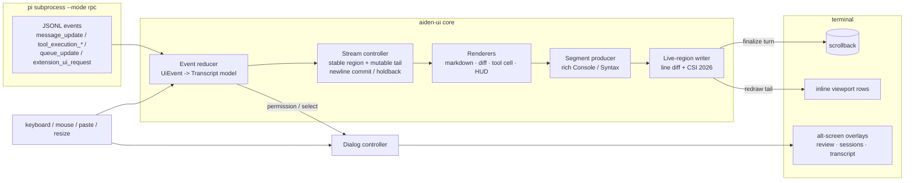

# Aiden Terminal UI — Framework Research and v0 Design

## TL;DR

- **Aiden's TUI is a renderer over pi's RPC event stream, not a widget app.** pi in `--mode rpc` emits `agent_start` / `turn_start` / `message_update` (`text_delta`, `thinking_delta`, `toolcall_*`) / `tool_execution_start|update|end` / `queue_update` / `compaction_*`, and asks for UI via `extension_ui_request` (`select`, `confirm`, `input`, `editor`, `notify`, `setStatus`, `setWidget`) [24]. Design the transcript model first, the toolkit second.
- **Framework decision: build a thin Aiden core (inline-first, ~1.5k lines) on `rich` (segments) + `prompt_toolkit` (input/keys/resize), with our own differential live-region writer.** Textual is the right tool for multi-pane dashboards, not for an agent loop that must leave the terminal's scrollback, selection and Cmd-F intact [1][19].
- **Textual 8.2.8 is genuinely capable** (asyncio workers, streaming `Markdown.append`, `MarkdownStream` coalescing, TextArea with tree-sitter highlighting, CSS-like TCSS themes, command palette, mouse + Kitty key protocol, Pilot golden tests) [2][3][4][5] — but it owns the alt buffer by default, has **no image/sixel support** and **no screen-reader integration** on its own roadmap [8], and churns breaking changes every major [2].
- **Inline + application-owned viewport is the 2025-26 consensus for agents**: Codex CLI renders an inline viewport and *inserts finalized history into the real scrollback* (`insert_history.rs`), with a per-terminal `ScrollbackStrategy` (Standard / Zellij / FullScreen) [28]. pi-tui ships exactly two interchangeable renderers, `TuiMainScreen` and `TuiAltScreen`, on one `TUI` interface [22]. Claude Code has a "classic" and a "fullscreen" renderer and gates features on which is active [26].
- **The hard problems are streaming, not pixels.** Copy Codex's mechanisms verbatim in Python: two-region streams (stable/committed + mutable tail), newline-gated commit boundaries, adaptive chunking with hysteresis (`Smooth` ↔ `CatchUp`), and **table/fence holdback** because a new table row reshapes every column [28].
- **Flicker is a protocol feature, not a luck-of-the-draw**: wrap every frame in synchronized output `CSI ? 2026h … l` (pi-tui [22], Codex via `crossterm::SynchronizedUpdate` [28], agentui [19]) and gate on capability detection — Textual had to *disable* synchronization in inline mode because some terminals break [2].
- **Frame budget: cap at 60-120fps, not "as fast as tokens arrive".** Codex clamps draw notifications to 120 FPS (`MIN_FRAME_INTERVAL` ≈ 8.33 ms) [28]; the unofficial Claude Code teardown throttles at 16 ms and diffs packed cells, skipping 99% of the screen via blit in steady state [27].
- **Visual identity: 53 semantic colour tokens, 2-column left gutter, one glyph per state, ASCII-fallback glyphs, reduce-motion respected** — model on pi's token set (thinking-level border colours, tool pending/success/error backgrounds, 3 diff tokens) [23] and Codex's `LIVE_PREFIX_COLS = 2` + `system_motion.rs` reading the OS reduce-motion flag [28].
- **Keyboard model: namespaced actions, chords in config, precedence documented** — pi's `tui.editor.cursorWordLeft` / `transcript.follow` style with multiple default chords is the pattern to steal [25]. Claude Code's `/diff` panel requires ≥110 columns and auto-opens ≥144 [26]: build width breakpoints into the spec, not as an afterthought.
- **Desktop later = same event log, new consumer.** Ship `aiden serve` (JSONL over HTTP/SSE/WebSocket) like opencode's server + desktop app [31], and a web UI over `UiEvent`s like aider's Streamlit front-end over its `InputOutput` sink [32]. Do **not** adopt Textual-in-the-browser (`textual-serve`) unless the TUI was written in Textual [10] — otherwise it forks the UI into a second widget tree.

---

## The pipeline: what actually has to be built

Every agent TUI is the same seven stages. Getting the seams right is what makes the framework choice survivable.



Notes that come from the sources rather than taste:

- Stage B must be **replayable**. `message_update` deliberately omits a cumulative message snapshot; clients are told to assemble partials by `contentIndex` and treat `message_end.message` as authoritative [24]. So the transcript is a pure fold over the event log — which is also what makes the desktop/web path cheap.
- `tool_execution_update.partialResult` is the *accumulated* output, not a delta ("clients can simply replace their display on each update") [24]. Do not diff-replace tool output yourself; overwrite and let the writer do line-diffing.
- Stage F is the only place that talks to the terminal. pi-tui's three rendering rules are the reference algorithm: first render writes all lines without clearing scrollback; width change or change above the viewport → clear screen + full re-render; otherwise move to the first changed line, clear to end of screen, write changed lines [22]. Textual's inline-mode write-up documents the same escape-code choreography (scroll up N, erase, redraw anchored beneath the prompt) from the other side [43].

## Framework decision matrix

### Python options (build here)

| Option | Async | Streaming markdown | Syntax highlight | Diff render | Mouse | Resize | Theming | Images | Verdict |
|---|---|---|---|---|---|---|---|---|---|
| **Textual 8.2.8** [1][2][9] | asyncio; `@work(thread=True)`, `exclusive`, `cancel` [5] | `Markdown.append()` + `Markdown.get_stream()` coalesces fragments that "can't be rendered fast enough" [3] | `Syntax`, `TextArea(syntax)` via tree-sitter extra [1] | none built in (no `textual-diff` on PyPI) | full: SGR 1000/1006/1015, `MouseMove`, `:hover` [6][7] | `Resize` event; layout recompute | TCSS (CSS-like), themes incl. Catppuccin/Rosé Pine/One, system dark/light [2] | **no** — sixel/half-block still unchecked on roadmap [8] | Right for a multi-pane "workspace" mode; wrong owner of the scrollback |
| **Rich 15.0.0** [11] | n/a (sync renderer) | `Live(screen=, refresh_per_second=4, transient=)`; `Console.screen()` alt buffer | Pygments, `Syntax`, `Markdown` | `diff_*` not built-in; use `Syntax` + your own hunks | no input at all | no | `Theme`, `push_theme` | no | Keep as the **segment producer**; never as the app |
| **prompt_toolkit 3.0.53** [12][13] | full async `Application`, `PromptSession` | incremental via async generators + `StdoutProxy` (`patch_stdout`) so other threads can print [13] | none itself (feed Rich segments) | none | `mouse_support=True`; `Vt100_Output` writes `\x1b[?1000h`, drag, SGR 1006 [13] | `Application` re-lays out on SIGWINCH | `FormattedText`, `Style`, `ColorDepth` 1/4/8/24 bit | no | Keep as the **input/driver layer**: keys, history, completion, multiline editor |
| **urwid 4.1.3** [14] | `AsyncioEventLoop` | none | via `Text` markup only | none | limited (curses/raw) | yes | palette lists | no; but renders to curses/**raw/HTML/LCD/web** from one widget tree | Only the multi-backend idea is worth stealing |
| **blessed 1.50.0** [15] | n/a | n/a | n/a | n/a | keycodes + caps, no widgets | `on_resize` | caps only | no | A `curses`-lite wrapper; too little for an agent loop |
| **pyTermTk** [18] | own loop | none | yes | none | rich mouse/drag | yes | Qt-like layouts, truecolour | yes (incl. images, 3D) | Feature-rich but idiosyncratic; small ecosystem, heavy abstraction |
| **agentic-tui / `agentui` 0.3.0** [19] | asyncio | **yes** — in-place streaming markdown, CSI 2026, "commits to permanent scrollback" | via rich | **yes** — unified diff block with inline `confirm()` | via prompt_toolkit | via prompt_toolkit | minimal | no | **Study and vendor the idea.** Its "Why" is our argument: Textual "owns the alt-buffer, breaks native terminal selection… overkill for a chat-shaped agent loop" |
| **pp-tui 0.2.0 / saber-tui 0.6.0** [20][21] | asyncio | pi-tui port: differential line updates | via your segments | build own | alt-screen mouse hit-test | full re-render on width | theme interfaces | kitty/iterm2 (pi-tui has `Image`) | Closest Python port of the reference design; young, small surface |
| **termkit 0.3.0** [16] | — | — | — | — | — | — | — | — | **Not a TUI kit.** Stdlib-only CLI *argument* framework (`@app.command()`). Do not confuse with de Icaza's TermKit or Node's terminal-kit |
| **pydantic-ui 0.6.0** [17] | FastAPI/SSE | — | — | — | — | — | web theming | — | **Not terminal at all**: React + FastAPI UI for nested pydantic models. Useful later for Aiden's config/eval dashboards |

### Non-Python references (study, don't depend on)

| Reference | Stack | Ideas worth stealing | Numbers we can hold ourselves to |
|---|---|---|---|
| **pi's own TUI** [22][23][25] | TS + `pi-tui` | two renderers behind one interface; overlays with `%`-based geometry; OSC 133 prompt-marker jumps; drag-select + OSC 52 copy; "Jump to latest" affordance while scrolled up; `Focusable`/`CURSOR_MARKER` APC so IME candidate windows land on the fake cursor | render strategy: 3 cases; differential lines; CSI 2026 both renderers |
| **Claude Code** [26][27] | forked Ink/React | two renderers (classic = scrollback, fullscreen = owned viewport); `Ctrl+O` transcript viewer; `Ctrl+E` "toggle show all"; `[` writes the conversation to native scrollback; `v` opens it in `$EDITOR`; Esc interrupts and *keeps* the work; queue + steer | custom fork: packed 2×Int32 cells, char/style/hyperlink interning pools, cell-level diff, blit for unchanged subtrees, 16 ms (≈60 fps) throttle, 120 fps cap ceiling [27] |
| **Codex CLI** [28][29] | Rust ratatui+crossterm+syntect | history *cells* as the transcript unit (`exec`, `patches`, `mcp`, `plans`, `notices`, `search`, `separators`); two-region stream controller; table/fence holdback; `ScrollbackStrategy` per-terminal workarounds; `pager_overlay` transcript; `terminal_palette.rs`/`terminal_probe.rs` capability probing; `system_motion.rs` reduce-motion; coalesced repeated reads dedupe in the tool trace | frame clamp 120 fps; `LIVE_PREFIX_COLS = 2`; insta `.snap` golden tests incl. `diff_gallery_80x24 / 94x35 / 120x40` |
| **Gemini CLI** [30] | TS, Ink | it pins a *forked* Ink (`ink: npm:@jrichman/ink@6.6.9`) + React 19 + `marked`: even at Google-scale the escape hatch was a custom renderer fork | — |
| **OpenTUI / OpenCode** [31] | Zig core, React/Solid bindings | Yoga flexbox in the terminal, renderables, in-memory snapshot testing; ships an agent *skill* documenting its own APIs | "powers OpenCode in production" |
| **opencode** [31] | client/server | `opencode serve` headless HTTP+OpenAPI; the TUI is just one client; desktop app ships alongside | — |
| **Ink** [33] | React renderer | `<Static>` for append-only output above a live region; `useInput/usePaste/useFocus/useCursor/useWindowSize`; `INK_SCREEN_READER`/`isScreenReaderEnabled` emitting an ARIA-ish text summary (`(checked) checkbox: Accept terms…`); `ink-testing-library` `lastFrame()` | — |
| **Warp** [39] | Rust, GPU | the **block model**: ordered typed blocks in a `SumTree` of heights → O(log n) viewport lookup; two-level virtualization (block-level + row-level); `GridStorage` (mutable) vs `FlatStorage` (packed, immutable scrollback) — the exact shape of a long agent session | alt-screen deliberately excluded from the block list |
| **Aider** [32] | rich + prompt_toolkit | `gui.py` is a Streamlit app whose `CaptureIO(InputOutput)` overrides `tool_output/tool_error/tool_warning` — the TUI is a *sink*, so a browser UI was ~1 file; `--watch` = agent talks to your IDE | deps today: `prompt-toolkit 3.0.52`, `rich 14.3.3`, `pygments`, `watchfiles` |
| **Cursor / Windsurf Cascade** [40][41] | desktop | checkpoints per request ("restore reverts files, not messages"); queue messages while the agent runs and reorder by drag; "steer at the next tool call"; side pane + timeline | — |
| **Zellij** [34] | Rust | declarative KDL layouts: `split_direction`, `size=5\|"80%"`, `stacked=true` + `expanded=true` (one-line collapsed titles with the focused pane pinned), `floating_panes { x y width height }`, `pane edit="a.rs"` for diff side-by-side | the stacked-pane pattern is a great session/tool-trace UI |
| **Ghostty / kitty / WezTerm** [35][36] | terminal emulators | features you may *assume* on a good terminal and must *degrade* without: Kitty graphics protocol (APC `ESC_G`, RGBA/RGB/PNG, deflate, 4096-byte base64 chunks, placements, negative `z` = under text, `U+10EEEE` placeholders), Kitty keyboard protocol, **synchronized rendering**, light/dark notification, grapheme clustering | kitty's own list of implementing terminals: Ghostty, Konsole, st+patch, Warp, WezTerm, iTerm2, xterm.js [36] |
| **delta** [38] | Rust | what a *good* diff looks like: syntax-highlighted both sides, optional side-by-side with auto line wrapping, line numbers, `n`/`N` hunk navigation, hunk-header folding | steal the keybindings, reimplement the layout |
| **notcurses / term-image** [36][37] | C / Python | if Aiden ever shows images (screenshots, plots): `term-image` handles kitty/iTerm2/sixel with text fallback; Textual can't do it at all today [8] | — |

### Decision, stated plainly

1. **`aiden/tui` is our own ~1.5k-line core**: `driver` (raw mode, alt screen, CSI 2026, mouse, kitty keys), `writer` (line-diff live region), `model` (transcript cells), `render` (rich segments), `keys` (actions→chords), `theme` (tokens). We are building a learning harness; owning the writer *is* the lesson, and it is the same shape pi-tui and Codex landed on [22][28].
2. **`rich` for segments, `prompt_toolkit` for the editor** (multiline input, history, completion, `StdoutProxy`, mouse/alt-screen primitives) [11][13]. Both are already what Aider ships [32].
3. **Keep a Textual escape hatch.** The `Cell → Lines` boundary means a Textual `Markdown`/`RichLog` shell can host the same model if we ever want a permanent three-pane workspace [1]. Also steal `textual-dev`'s tricks: Pilot-style scripted golden tests and SVG frame export for docs [2].
4. **Never block the event loop for highlighting.** Textual's own threading example pushes `Markdown.update` through `call_from_thread` [42]; we do it with a worker thread + monotonically increasing render sequence, dropping stale renders instead of queueing them.

## What great agent UIs do

1. **The transcript is a list of typed cells, not a text stream.** Codex has `history_cell/{exec,mcp,patches,plans,notices,search,separators,session}.rs`; pi renders tool boxes with pending/success/error backgrounds [23][28]. Cells give you collapse, expand, copy, re-render at new width, and cheap status colour.
2. **Finalized content leaves the app's ownership and goes into the real scrollback.** Codex: "inserting a history cell is an escape-sequence operation rather than a normal ratatui render", with a `HistoryLineWrapPolicy` of `PreWrap` vs `Terminal` [28]. Native select, tmux copy, Cmd-F and scrollback search keep working — the single biggest UX reason to avoid an always-alt-screen agent.
3. **Two regions while streaming: a stable prefix and a mutable tail.** From `codex-rs/tui/src/streaming/controller.rs`: *"Each stream partitions rendered markdown into a stable region (committed to scrollback…) and a tail region (mutable, displayed in the active-cell slot)"* [28].
4. **Commit at newline boundaries, never per token.** `markdown_stream.rs`: *"buffers incoming token deltas and exposes a commit boundary at each newline… the trailing incomplete line stays in the buffer"* [28]. Textual implements the identical idea with `_last_parsed_line` so only new lines are re-parsed [3].
5. **Adaptive catch-up with hysteresis.** `chunking.rs`: one line per tick in `Smooth`; under queue pressure switch to `CatchUp` and drain; exit is held for `EXIT_HOLD` and re-entry suppressed for `REENTER_CATCH_UP_HOLD` "to avoid rapid gear-flapping" [28]. Slow terminals degrade to fewer, bigger updates — not to a UI that finishes 40 seconds late.
6. **Hold back anything non-incremental.** Tables: *"adding a new row can change every column's width and reshape all prior rows"*, so the header onward stays mutable until finalize; same for unterminated code fences (`streaming/code_fence.rs`, `table_holdback.rs`) [28]. agentui does the same by only managing the currently-streaming region [19].
7. **Thinking is present but subordinate.** pi renders thinking text in its own token and encodes the *level* in the editor border colour (`thinkingOff…thinkingMax`), with `hideThinkingBlock` and `thinkingMax` fallbacks [23]. Claude Code binds Option/Alt-T to toggle extended thinking and Codex shows a reasoning status line that survives tool activity [26][28].
8. **Tool calls collapse to one line and stay expandable.** Codex dedupes repeated reads across calls ("coalesced reads dedupe names" snapshot tests) [28]; agentui "collapses automatically after completion" [19]. Detail on demand (`e` / space / click), never by default.
9. **Approval prompts show the exact payload, are inline, and have an out for the next 50 times.** Codex renders exec/patch approval overlays including *patch destination* and additional-permission prompts [28]. Claude Code has permission-mode cycling (`Shift+Tab`) with plan/auto-accept states [26]. A prompt that only says "Allow?" trains the user to say yes to nothing.
10. **Interrupt preserves work.** Claude Code's Esc: *"Stop the current response or tool call mid-turn so you can redirect. Claude keeps the work done so far"* [26]; agentui commits partial content on Ctrl-C so "terminal state is never corrupted" [19].
11. **You can keep talking while it works.** pi's RPC has `steer`, `follow_up`, `clear_queue`, `queue_update`, `streamingBehavior:"steer"` [24]; Cursor queues, drag-reorders, and steers "at the next tool call"; Claude Code's `Ctrl+S` stashes the prompt [26][40].
12. **Cost and context are always-visible but one glance.** pi's `get_session_stats` returns `tokens.{input,output,cacheRead,cacheWrite,total}`, `cost`, and `contextUsage.{tokens,contextWindow,percent}` — and notes `percent` is `null` right after compaction [24]. Codex keeps a configurable status line with thread usage and rate limits [28]. Treat "unknown" as a first-class render state.
13. **Escape hatches to text.** `/export` HTML, `write the conversation to a temporary file and open it in `$EDITOR``, `[` → native scrollback (Claude Code) [26]; pi's `export_html` RPC command [24]; Codex's markdown-transcript snapshots [28]. Every rich surface needs a boring one behind it.
14. **Responsive by column count, tested at three widths.** Claude Code: the diff panel needs ≥110 columns and auto-opens at ≥144 [26]; Codex snapshot-tests `diff_gallery_80x24`, `94x35`, `120x40` and truncation with halfwidth kana [28]; pi-tui overlays take `visible: (termWidth, termHeight) => termWidth >= 100` [22].
15. **Capability detection with user overrides.** pi probes OSC 8 / image protocol / truecolor and lets you force it (`PI_HYPERLINKS`, `PI_IMAGE_PROTOCOL=kitty|iterm2|none|auto`) [27]; Codex has `terminal_probe.rs`, `terminal_palette.rs`, `keyboard_modes.rs` with an env kill-switch `CODEX_TUI_DISABLE_KEYBOARD_ENHANCEMENT` [28]; Ghostty documents ligatures, grapheme clustering and dark/light notification as *app-developer* features you can only assume on some terminals [35].
16. **A11y is partly solved upstream of you.** Ink emits `(checked) checkbox: Accept terms and conditions` when screen-reader mode is on [33]; Codex reads the OS reduce-motion preference at launch and gates `tui.animations` [28]; Textual ships monochrome mode but screen-reader integration is still an unchecked box [8].
17. **Testing is golden frames + scripted keys.** insta snapshots everywhere in Codex [28], Textual `Pilot` (incl. `double_click`, `press`) and SVG export [2], `ink-testing-library`'s `lastFrame()` [33], OpenTUI's in-memory render [31]. If your UI can't be snapshotted, it will regress.

## Aiden UI spec v0

### Modes

| Mode | Trigger | Buffer | Use |
|---|---|---|---|
| `inline` (default) | `aiden` | main screen, scrollback preserved | 95% of use; tmux- and ssh-friendly |
| `review` | `d`, `/diff`, auto on ≥140 cols | alt screen | hunk/file accept-revert |
| `transcript` | `Ctrl+O` | alt screen | search, jump between prompts, export |
| `sessions` | `Ctrl+G` | alt screen | resume/fork/archive |
| `plain` | `aiden -p` / `AIDEN_TUI=plain` | stdout only | pipes, CI, screen readers, `less` |
| `serve` | `aiden serve` | none | HTTP/SSE + WS for web/desktop clients |

Alt-screen screens are **transient**: on exit they print the final document back to the main buffer (pi-tui's `TuiAltScreen.stop()` behaviour) [22]. Never park the agent in the alt buffer.

### Information architecture

Four layers, strictly one-directional:

1. **Transcript** (centre) — append-only list of `Cell`s: `UserPrompt`, `AssistantText`, `Thinking`, `ToolCall`, `Diff`, `PlanUpdate`, `Notice`, `Compaction`, `SessionLine`, `Approval`. Reconstructible from the session `.jsonl` alone.
2. **Rail** (right, ≥100 cols) — plan/todo progress, touched files with `+n -m`, memory/skill counts, cost+context meters. Collapsible to a one-line HUD.
3. **Dock** (bottom) — editor, mode chips (`~` ask `!` shell `#` remember `/` command `@` file), steering queue, hints line.
4. **Overlays** — review, transcript pager, sessions, permission prompt, key help, `/model`+`/thinking` pickers, `:status`.

### Streaming a turn

State machine (also the reducer's shape):

```
            +---------+   prompt     +----------+
  idle ---> | queue   | ------------ | streaming|
            +---------+              +----+-----+
                 ^                       | text_delta / thinking_delta / toolcall_*
                 | queue_update          v
            +----+-----+  toolcall_end  +-----------+
            | committed | <------------- | tool-run  |--- is_error --> notice
            +-----------+  cell.finalize +-----------+
                 |  turn_end                ^  |
                 v                          |  v  approval pending (inline prompt in transcript)
            +----------+   agent_settled  +-------------+
            | settled  | <-------------- | awaiting-OK |
            +----------+                 +-------------+
                 |  retry / compaction: notice cell, stream resumes (do not clear)
```

Rules:
- Commit only at newlines; keep the last incomplete line in the tail (pi `markdown_stream.rs`, Textual `_last_parsed_line`) [24][3].
- Hold back pipe tables and unterminated fences as tail; render them once, whole, at finalize [28].
- `thinking_delta` renders into a folded cell: `▌ thinking 14s · 1.9k tok (t)`; `t` expands, `hide_thinking` writes it collapsed permanently [23].
- `tool_execution_update` overwrites the cell's output (accumulated, not delta) and repaints only changed lines [24].
- Ctrl-C/`Esc`: `abort` the RPC in-flight run, commit partials, mark the cell `aborted` — never erase [24][26].
- Long tool output: cap visible lines (default 12) with `… 240 more (e)`; keep the full text out of the render path (Textual's `RichLog(max_lines=…)` gives the same trade-off) [1].

### Diff review flow

`d` on a `Diff` cell, or `/diff` for the whole turn (a **checkpoint** is taken before the agent's first write, like Cursor [40]):

1. File list header with `+n -m` per file; `TAB`/`j`/`k` move; `p`/`n` hunk (delta's `navigate` semantics) [38].
2. Accept/reject is **per hunk**, with per-file and per-turn shortcuts (`1`/`2`/`3` in the mock); rejecting a hunk re-asks the agent rather than silently editing.
3. `a` writes to the working tree only; committing is a separate, explicit step (`git commit` appears as a normal `ToolCall` cell).
4. `c` restores the pre-turn checkpoint — files only, transcript untouched; state it in the UI copy exactly that way [40].
5. Auto-open the panel only at ≥140 cols, require ≥110 to show it at all (Claude Code precedent) [26]; below that, inline unified diff with `space` to expand.
6. Renderer: our own `Diff` cell (no PyPI diff widget for Textual either), styled per-token `diff_added/diff_removed/diff_context` [23], line numbers, wrapped long lines, `syntect`-grade highlighting via Pygments/tree-sitter on the *new* side only.

### Permission prompts

Rendered **inside** the transcript at the position of the tool call (an `extension_ui_request` with `method:"select"`, answered by `extension_ui_response` with the matching `id`; timeouts auto-resolve agent-side so the UI never owns them) [24]. Content: verbatim command or patch, cwd, network/writes verdict, the rule that *would* have matched, and a suggested rule string to persist to `.aiden/rules.toml`. Choices are digits 1-4 plus `e` edit and `d` diff; `Esc` = deny; typing anything else filters the "why" free-text path (pi's `input` dialog) [24]. Mode chip (`readonly` / `workspace` / `yolo`) cycles with `Shift+Tab` and is always visible in the HUD, because the whole UI's honesty depends on it [26][28].

### Cost / token HUD

One line, always the same slots, `—` for unknown:

`ctx 61% of 200k · in 41.2k (cw 38.1k cr 0) · out 1.3k · $0.114 turn / $1.82 session · 12s · queue 1`

Sources: cumulative `usage` on `message_update`, `get_session_stats` for session totals and `contextUsage` [24]. Add a cache-hit ratio badge — the numbers are already in the payload and they teach the user why `read` paging matters (ties into 02-tooling-efficiency.md). Warn at 80% context with a `[ compaction at 80% ]` rail line, and show a `compacting…` notice cell on `compaction_start`/`compaction_end` [24].

### Session browser

`Ctrl+G` → alt-screen list (mock below): timestamp, auto-title, git branch+dirty, cost, ctx %, turns, fork parent, error/aborted markers, `~` for background/sleep-time runs. Actions: `enter` resume (`switch_session`), `f` fork, `x` archive, `n` new (`new_session` with `parentSession`), `Ctrl+R` rename, `Ctrl+D` delete; `/` fuzzy search over titles and message text (pi stores sessions as `.jsonl`; `/sessions` is a client-side index) [24]. The bottom line renders the branch tree so "which recap produced this" stays visible — pi already models parent/child sessions and Codex renders "forked thread history line" cells [24][28].

### Keyboard model

Actions, not keys, are the API (pi's namespaced ids + multiple default chords are the template) [25]. Config at `.aiden/keybindings.toml`; unknown ids error at startup.

| Action | Default chord(s) | Notes |
|---|---|---|
| `transcript.follow` / `.pageUp` / `.bottom` | `PgUp`/`PgDn`, `Ctrl+End` | wheel over the transcript; "jump to latest" row while scrolled [22] |
| `transcript.search` | `Ctrl+F`, `Ctrl+Shift+F` | previous/next = `Enter` / `Shift+Enter`, `Ctrl+G` closes [22] |
| `turn.interrupt` | `Esc` | keeps partial work [26] |
| `input.clear` / `input.quit` | `Ctrl+C` then `Ctrl+C`, `Ctrl+D` | one press clears, two quit (Claude Code) [26] |
| `input.newLine` | `Shift+Enter`, `Ctrl+J` | `Ctrl+J` alias because tmux eats shift+enter [25] |
| `steer.now` / `queue.add` / `queue.edit` | `Enter` twice / `Tab` / `q` | pi `steer` + `follow_up` [24] |
| `thinking.toggle` / `tool.expand` | `t` / `e` | per-cell |
| `review.open` / `.acceptHunk` / `.revertHunk` | `d` / `y` / `n` | |
| `perm.allowOnce` / `.allowRule` / `.deny` | `1` / `2` / `4`, `Esc` | |
| `model.cycle` / `thinking.cycle` | `Ctrl+P`/`Meta+P` | editor-history wins when the prompt is focused (documented precedence) [25] |
| `sessions.open` / `todo.open` / `files.open` / `transcript.viewer` | `Ctrl+G` / `Ctrl+T` / `Ctrl+F`-hold / `Ctrl+O` | [26] |
| `keys.help` | `?` (when the prompt is empty) | |

`Meta`/`Alt` reliability is a terminal property, not ours: detect the Kitty keyboard protocol and fall back to documented aliases (`Ctrl+left` for word-nav) with a `--check-keys` diagnostic [36][28].

## ASCII layout mocks

Frames are ASCII; the marks `[x] [>] [.] [!] ( ) :` are the ASCII fallbacks for `✓ ◐ · ⚠ ▾ │` defined under *Visual identity*.

**1. Workspace — 120 × 32 (external monitor / large tmux pane)**

```
+----------------------------------------------------------------------------------------------------------------------+
|aiden  ~/src/aiden  main*  anthropic/claude-opus-4-1  think:high    ctx 61%   in 41.2k  out 1.3k   $1.82   12s        |
+-----------------------------------------------------------------------------+----------------------------------------+
| you   fix the flaky test in tui/scrollback_test.py; it fails on CI only     |context                                 |
| ai   Reading the failing test first. Two suspects: clock skew or            |plan   3/5                              |
|      ( ) thinking 14s - t to expand - 1.9k tok                              | [x] read failing test                  |
|      [x] read   tests/tui/test_scrollback.py        212 lines               | [x] locate race                        |
|      [>] bash   pytest tests/tui/test_scrollback.py -q   12s                | [>] fix + re-run                       |
|      : Failed: test_follows_resized_tail - assert 4 == 5                    | [ ] commit                             |
|      [.] read   aiden/tui/live_region.py              88 lines              | [ ] summarize                          |
| ai   The tail-follow is racy: it re-renders on resize but the               |files                                   |
|      pending delta is committed before the new width is known.              | M src/aiden/tui/live_region.py         |
|      Guard the commit with the frame viewport, then re-run.                 | M tests/tui/test_scrollback.py         |
|                                                                             | R docs/research/06-ui-ux.md            |
|      src/aiden/tui/live_region.py   +14 -3   (d) review                     |mem                                     |
|        41  def commit(self, lines):                                         | repo: pytest -q from repo root         |
|      - 42      self._pending += lines                                       | pref: no emoji in diffs                |
|      + 42 +    if self._viewport != self._frame_viewport:                   |skills   2 loaded                       |
|      + 43 +        self._drain()   # width changed mid-stream               |cost   this turn                        |
|                                                                             | in 41.2k (cw 38.1k cr 0)               |
|      2 files  +31 -6   a accept  r revert  p/n hunk                         | out 1.3k                               |
|                                                                             | $0.114 | session $1.82                 |
| ai   1 hunk accepted, 1 hunk pending approval                               |ctx 61% of 200k                         |
|      [x] git commit -m 'guard live-region commit'                           | [ compaction at 80% ]                  |
|      [!] bash  cargo test    needs approval  (s)cope                        |                                        |
|                                                                             |                                        |
+----------------------------------------------------------------------------------------------------------------------+
|>                                                                                                                     |
|  ~ ask   ! shell   # remember   @ file   / command                    queue: 1   q edit                              |
+----------------------------------------------------------------------------------------------------------------------+
|^O transcript  ^T todo  ^F files  ^G sessions  d diff  t thinking  e expand  Esc interrupt  ^C clear  ? keys          |
+----------------------------------------------------------------------------------------------------------------------+
```

**2. Laptop — 94 × 27 (rail collapses to a 4-line meter)**

```
+--------------------------------------------------------------------------------------------+
|aiden  ~/src/aiden main*  claude-opus-4-1  think:high    ctx 61%   $1.82   12s              |
+------------------------------------------------------------+-------------------------------+
| you   fix the flaky test in tui/scrollback_test.py         |ctx 61%  $1.82                 |
| ai   Reading the failing test first.                       |2 files +31 -6                 |
|      ( ) thinking 14s - t                                  |plan 3/5                       |
|      [x] read  tests/tui/test_scrollback.py                |queue 1                        |
|      [>] bash  pytest -q   12s                             |                               |
|      : Failed: assert 4 == 5                               |                               |
| ai   The tail-follow is racy: it re-renders                |                               |
|      on resize but commits the pending delta               |                               |
|      before the new width is known.                        |                               |
|                                                            |                               |
|      live_region.py  +14 -3  (d) review                    |                               |
|      - 42    self._pending += lines                        |                               |
|      + 42+   if self._viewport != _frame_vp:               |                               |
|                                                            |                               |
|      2 files +31 -6   a accept   r revert                  |                               |
|      [!] bash cargo test  needs approval                   |                               |
|      (rail collapsed: ^F files, ^T todo)                   |                               |
|                                                            |                               |
+--------------------------------------------------------------------------------------------+
|>                                                                                           |
| ~ ask  ! shell  # remember  @ file  / command                                              |
+--------------------------------------------------------------------------------------------+
|^O transcript   d diff   t thinking   Esc interrupt   ? keys                                |
+--------------------------------------------------------------------------------------------+
```

**3. Narrow — 60 × 20 (tmux split, ssh on a laptop; no rail, one-line HUD)**

```
+----------------------------------------------------------+
|aiden main* opus-4-1 high  ctx61%  $1.82                  |
+----------------------------------------------------------+
| you  fix the flaky scrollback test                       |
| ai   The tail-follow is racy: it re-renders              |
|      on resize but commits the pending delta             |
|      before the new width is known.                      |
|      ( ) thinking 14s   t                                |
|      [x] bash pytest -q   12s                            |
|      live_region.py +14 -3   d                           |
|      - 42   self._pending += lines                       |
|      + 42+  if self._viewport != _vp:                    |
|      [!] cargo test  approve? y/n                        |
|                                                          |
+----------------------------------------------------------+
|> fix the flaky scrollback test                           |
| ~ ! # @ /   queue 1                                      |
+----------------------------------------------------------+
|^O transcript  d diff  Esc stop  ? keys                   |
+----------------------------------------------------------+
```

**4. Diff review (transient alt screen, 106 × 19)**

```
+--------------------------------------------------------------------------------------------------------+
|REVIEW   turn #7  'fix flaky scrollback test'      2 files   +31 -6      checkpoint pre-turn: c restore |
+--------------------------------------------------------------------------------------------------------+
|  M  src/aiden/tui/live_region.py           +14  -3      [a]ccept file   [r]evert file                  |
|     39          self._drain()                                                                          |
|     40                                                                                                 |
|     41      def commit(self, lines):                                                                   |
|   - 42          self._pending += lines                                                                 |
|   + 42 +    if self._viewport != self._frame_viewport:                                                 |
|   + 43 +        self._drain()          # width changed mid-stream                                      |
|   + 44 +    self._pending += lines                                                                     |
|     45          self._dirty = True                                                                     |
|   + 46 +    self._frame_viewport = self._viewport                                                      |
|     hunk 2/3      n next hunk   p prev   N next file   j/k scroll   / search                           |
|                                                                                                        |
|  M  tests/tui/test_scrollback.py           +17  -3      TAB files   1 accept  2 reject  3 keep         |
+--------------------------------------------------------------------------------------------------------+
| a accept all   r revert all   c checkpoint   q return to transcript (keeps diff)   ? keys              |
+--------------------------------------------------------------------------------------------------------+
```

**5. Permission prompt (inline cell, 90 × 13) and session browser (98 × 12)**

```
+----------------------------------------------------------------------------------------+
|PERMISSION   bash   turn #7 tool 4/6               mode: workspace   shift+tab cycles   |
+----------------------------------------------------------------------------------------+
|  cargo test --features tui                                                             |
|  cwd ~/src/aiden    network: yes    writes: target/ (not in allowlist)                 |
|                                                                                        |
|  [1] allow once            [2] allow rule for this session                             |
|  [3] allow rule and edit   [4] deny and say why                                        |
|  [e] edit command          [d] show planned writes as diff                             |
|                                                                                        |
|  suggested rule: allow bash `cargo test*` in ~/src/aiden  ->  .aiden/rules.toml        |
|  auto-deny in 55s (set permission_timeout=0 to disable)   esc = deny                   |
+----------------------------------------------------------------------------------------+

+------------------------------------------------------------------------------------------------+
|SESSIONS   ~/src/aiden   38 sessions      / search   enter resume   f fork   x archive   n new  |
+------------------------------------------------------------------------------------------------+
|  *  2026-09-14 14:02  fix flaky scrollback test       main*  $1.82   61%    4 turns            |
|  .  2026-09-14 09:41  research: pi rpc events         main   $0.34   22%   11 turns  fork #12  |
|  .  2026-09-13 22:15  audit live-region perf          main   $4.10   78%   33 turns  archived  |
|  .  2026-09-13 18:02  memory consolidation loop       HEAD   $2.02   45%   19 turns            |
|  ~  2026-09-12 11:30  reflect on 12 sessions          -      $0.90    -    sleep-time job      |
|  .  2026-09-11 16:44  rewrite diff renderer           -      $0.05    3%    1 turn  aborted    |
+------------------------------------------------------------------------------------------------+
| tree:  #4 ---------- #12 -------- #37 (active)     ctrl+R rename  ctrl+D delete  esc close     |
+------------------------------------------------------------------------------------------------+
```

Breakpoints (hard rules in code, tested): `≥140` rail + auto diff panel · `100-139` rail with meters only · `80-99` no rail, HUD carries ctx+cost · `<80` hints line drops to 4 keys, cell padding 2→0, `+n -m` becomes `d` suffix [26][22].

## Visual identity

**Posture.** The look is "lab instrument, not chat app": dense, left-aligned, low-chrome, one accent, informative without shouting. Type is a monospace at 14-16 px with a *real* bold face (JetBrains Mono / Iosevka / Berkeley Mono); no ligatures inside our chrome (they break cell-width maths and our own alignment tests), no emoji in diffs. Unicode is fine but must be width-correct — Codex tests halfwidth kana and sound marks in narrow terminals, which is the discipline to copy [28].

**Glyph set** (each with an ASCII fallback selected when `AIDEN_ASCII=1`, `LANG=C`, or the terminal reports ≤8 colours):

| Meaning | Glyph | ASCII | Meaning | Glyph | ASCII |
|---|---|---|---|---|---|
| user line | `›` | `>` | ok | `✓` | `[x]` |
| assistant line | `ai` | `ai` | running | `◐` | `[>]` |
| thinking | `▌` | `( )` | queued | `·` | `[.]` |
| collapsed / expanded | `▸` `▾` | `>` | approval needed | `⚠` | `[!]` |
| error | `✗` | `[x]` red | context meter | `▁▂▄▆█` | `#----` |
| removed / added / context | `−` `+` `⎵` | `- +` | mouse pointer | `✚`/hand | n/a |

Boxes are drawn with single-line `│─╭╮╯╰` only in overlays; the transcript uses **no vertical borders** — indentation and colour do the grouping, because borders cost 2 columns and fight copy-paste. `+ 42 +` above is real: gutter `│` for continuation lines, then the diff sign.

**Space rhythm.** `LIVE_PREFIX_COLS = 2` (Codex) → Aiden's left gutter is 2 columns for every continuation line and 1 blank line between cells; 1 column of padding inside cells (`outputPad` in pi is 0-or-1 for exactly this reason) [23][28]. Vertical whitespace is the primary separator; horizontal rules only at turn boundaries and only at `≥100` cols.

**Colour tokens.** 40 tokens, all required, grouped like pi's 53 (core 13 / backgrounds 11 / markdown 10 / diff 3 / syntax 9 / thinking 6) [23]:

```
# core
text muted dim accent border border_muted border_accent success error warning
scrollbar_track scrollbar_thumb selected_bg
# content
user_bg user_text tool_pending tool_ok tool_err tool_title tool_output
thinking_text md_heading md_link md_code md_codeblock md_quote md_hr
# diff + code
diff_added diff_removed diff_context
syn_comment syn_keyword syn_func syn_var syn_string syn_num syn_type syn_op syn_punct
# state that must survive greyscale
lvl_off lvl_min lvl_low lvl_med lvl_high lvl_xhigh
```

Themes ship as `dark.toml` / `light.toml` + user TOML override; syntax themes come from Pygments styles so delta/neovim users can keep their palette [38]. Requirements: every token has an **ANSI-16-safe mapping** (Textual's own docs note terminals offer 16 themeable ANSI colours and it remaps them by default — we must be legible when the user has remapped theirs) [1]; text-on-background contrast ≥4.5:1 and status never colour-only (glyph + word); `AIDEN_NO_COLOR=1`/`NO_COLOR` → monochrome with weight/underline/case carrying meaning (Textual already ships monochrome mode as the reference) [8]; light/dark autodetect via OSC 10/11 + `ThemeSwitched`, and respect the terminal's dark/light notification where it exists (Ghostty) [35].

**Motion.** Spinners shimmer, cells do not bounce. `animations = auto|on|off`; `auto` reads the OS reduce-motion preference the way Codex does at launch [28]. `◐` rotates ≤8 fps — deliberately below frame budget; a smooth spinner on a slow SSH link is a bandwidth leak. Follow-the-tail scroll easing off when `plain` or when reduced motion is set.

**Microcopy.** Lowercase verbs (`accept`, `revert`, `interrupt`), `Code` for paths/commands, no exclamation marks, errors state the *next action* ("`pytest` exited 1 — read tail with `e`"). The HUD never lies: unknown cost is `—`, not `$0.00`.

## Perf budget

Targets are checked in CI by a benchmark harness that replays recorded RPC event logs against an in-memory terminal (insta-style frame snapshots, like Codex; Textual's `Pilot` + SVG export is the same idea in Python) [2][28].

| Surface | Budget | Enforcement |
|---|---|---|
| Steady-state frame (spinner only) | p50 ≤ 3 ms, p99 ≤ 8 ms; ≤ 400 bytes written | damage rect: paint changed lines only [22][27] |
| Full frame at 120×40 | ≤ 12 ms | model render is cached per cell; only the tail repaints |
| Frame rate cap | 60 fps (`≈16.6 ms`); hard ceiling 120 fps | draw-notification clamp [28] |
| Commit ticks while streaming | 20-30/s, 1 line/tick `Smooth`, drain `CatchUp` | hysteresis so gears don't flap [28] |
| Markdown reparse | new completed lines only | `_last_parsed_line` precedent [3] |
| Syntax highlight | ≤ 2 ms/file typical; off the main task | worker thread + `call_from_thread`-style posting [4][42] |
| Tool output update | overwrite, diff lines; visible ≤ 12 lines | `partialResult` is cumulative [24] |
| Keyboard → visible echo | p99 ≤ 30 ms (incl. `Esc` interrupt ack) | no I/O in key handlers |
| Resize | coalesce to ≤ 1 reflow / 100 ms; clear+full re-render allowed | width change is the documented "expensive" case [22] |
| Alt-screen overlay open/close | ≤ 2 frames, no flash | deferred erase inside the synchronized block, pi-tui/Codex [22][28] |
| Memory | transcript cells are the only growth; finalized text goes to *terminal* scrollback | inline-first architecture; Warp's `FlatStorage`/immutable-block argument is the theory [39] |
| Startup (TUI ready) | ≤ 150 ms | lazy Pygments lexer load; rich already lazy-loads imports [11] |
| Output bytes | ≤ 2 KB/frame during a normal stream | measured per frame, logged in `--perf` |

**Flicker rules (non-negotiable).** (1) Every frame wrapped in `CSI ?2026h/l` *when capability-detect says the terminal has it*; fall back silently — Textual disabled sync in inline mode because "it breaks on some terminals", so the gate is the feature [2][7]. (2) Never `clear`; move to the first changed row and erase-to-end. (3) Never re-print finalized lines. (4) Style state is per line: emit a full SGR + OSC 8 reset at each line end so a dropped frame can't leak colour (pi-tui's rule) [22]. (5) Capability probes (`DA1`, `XTGETTCAP`, OSC 11) must not delay first paint — Codex keeps a `terminal_probe` + `startup_replay` for exactly this [28].

**Accessibility budget.** `plain` mode is a screen-reader-readable linear transcript (Ink's ARIA-ish `(checked) checkbox:` output is the model [33]); full keyboard operation with no mouse-only affordance (mouse is an *additive* hover/click layer as in Textual [6]); every colour pair tested at 4.5:1 and in `NO_COLOR`; resize reflow keeps reading order; IME-safe hardware cursor via a `CURSOR_MARKER`-style zero-width APC [22]; documented per-terminal gotchas (iTerm2 fast-trackpad wheel loss, Ghostty link hover while mouse is captured, tmux's prefix, macOS Option-as-Meta, WSL keyboard enhancement off) shipped in `aiden doctor` and a `docs/terminal-setup.md` equivalent [27][28].

## Path to desktop app

The UI is a *consumer of a log*. Keep it that way and the desktop app is a second consumer, not a rewrite.

- **Phase 0 (now).** `aiden/model/events.py` defines the canonical `UiEvent` union; the reducer produces it from pi RPC; the TUI consumes only that, never pi's raw JSON. Everything else follows.

```python
class UiEvent(BaseModel):  # one per transcript-visible change
    kind: Literal[
        "turn.start",
        "text.delta",
        "thinking.delta",
        "cell.finalize",
        "tool.start",
        "tool.progress",
        "tool.end",
        "diff.offered",
        "approval.requested",
        "approval.resolved",
        "queue.updated",
        "usage.updated",
        "notice",
    ]
    seq: int
    cell_id: str | None = None
    text: str | None = None
    usage: Usage | None = None  # mirrors pi's cumulative usage payload [24]
```

- **Phase 1: `aiden serve`.** HTTP + WebSocket/SSE: `GET /sessions`, `GET /sessions/{id}/events` (replay), `POST /prompt|/steer|/abort`, `WS /ws` for the live `UiEvent` stream, `POST /approval/{id}`. Deliberately the shape opencode settled on (headless `opencode serve`, OpenAPI, TUI as one client, desktop app + web + IDE as others) [31], and the shape aider proved cheaply: its Streamlit UI is just a `CaptureIO(InputOutput)` subclass over the same coder [32]. The TUI becomes the first client of its own protocol — dogfood it or the desktop build will diverge.
- **Phase 2: browser UI as a real UI.** React/`@opentui/react`-style component tree over the `UiEvent` stream; reuse the transcript CSS as the spec (fixed grid, same tokens, same glyphs) so "the web one" is recognisably Aiden; add what the terminal can't do: inline images, resizable panes, a real click-through diff, multi-session split view. Terminal-side, the alternative is Textual's own web stack (`textual-serve` turns a TUI into a web app [10]) — fast to demo, but it renders *your TUI* in a browser, so it's only cheap if we'd built in Textual (we didn't: §Framework decision matrix). Treat it as a throwaway spike at most.
- **Phase 3: desktop shell.** Tauri (Rust shell + the Phase-2 web assets, `aiden serve` as a sidecar) — small binary, native menus, notifications, per-window sessions; Nuitka/PyInstaller for the Python side. Zellij-style declarative layouts (KDL `split_direction`, `size`, `stacked` + `expanded`) are worth copying for window/pane presets [34].
- **Phase 4: platform glue.** Global quick-terminal entry (Ghostty-style), OSC notifications → native toasts, file/protocol handlers (`aiden://session/…`), clipboard images (Windows Terminal binds `Alt+V` for image paste — pi documents it [27]), and multi-agent monitoring where the session browser becomes the dashboard (pi's `steer`/`follow_up`/subagent RPC already supports it [24]).

What must stay true throughout: the event log is the interface, the transcript model is reconstructible from disk, and every surface degrades to `plain`.

## Implications for Aiden

**Copy**
1. Cell-based transcript + `finalize` into real scrollback; two-region streaming; newline commit boundaries; adaptive chunking with hysteresis; table/fence holdback [28].
2. Differential line writer + synchronized output + per-line SGR/OSC-8 reset [22].
3. One `TUI` interface, two renderers (`inline`, `alt`) behind `AIDEN_TUI=…` [22].
4. Namespaced keybinding actions with multiple chords and documented precedence [25].
5. pi's colour-token taxonomy (~40 of the 53 tokens), `hideThinkingBlock`, `outputPad`, `fullscreenScrollbar` policies [23].
6. Overlay geometry as data (anchor, `%` sizes, `visible(w,h)` responsive predicate) [22].
7. Golden frame tests + a recorded-event replay bench; three width snapshots from day one [28][2].
8. Tool cells that collapse after success, dedupe repeated reads, and expose `e` for the tail [28].
9. Diff review with hunk granularity, `n`/`p` navigation and checkpoints that revert files only [38][40].
10. OSC 8 hyperlinks with an auto-fallback to plain text when detection fails (`FORCE_HYPERLINK`-style override) [26][24].

**Skip**
- **Textual as the agent-loop host** (alt-buffer ownership, widget-per-block cost on long transcripts, no images, breaking majors) — keep it as an option for a future always-on workspace shell [1][2][8].
- Full-screen-permanent mode; users lose tmux/iTerm scrollback and native search, which is the entire value of a terminal agent.
- urwid/blessed as a base — neither gives us markdown, diff, or a token theme; urwid's *multi-backend* (raw/curses/HTML/web) idea is worth revisiting only if we abandon the web path [14][15].
- `termkit` and `pydantic-ui` as UI layers (they aren't TUI kits — see the matrix) [16][17].
- Ink/pyink or a React-in-terminal layer in Python: 24k cells/frame of GC pressure is why Claude Code rewrote its renderer and why Gemini pins a fork [27][30][33].
- Inline images in v0 (nothing in Python does it cleanly; `term-image` stays a v2 spike) [8][37].
- Braille/emoji decoration, animated progress flourishes, colour-only status.

**Build list for `aiden/tui` (v0 files).** `driver.py` (raw mode, alt, CSI 2026, mouse, kitty keys, capability probe) · `writer.py` (live region + damage + finalize) · `model.py` (`Cell` union, reducer over `UiEvent`) · `stream.py` (commit ticks, chunking, holdback) · `render/{markdown,diff,tool,hud}.py` on rich segments · `keys.py` (actions←TOML) · `theme.py` (tokens + dark/light + `NO_COLOR`) · `screens/{review,transcript,sessions,approval}.py` · `plain.py` · `doctor.py`.

## Open questions

1. Does a *permanently* inline transcript hold up past ~5 000 cells in the host terminal's scrollback (iTerm2/Ghostty differ a lot), and does `aiden` need its own `FlatStorage`-style packed history, or is that the host's job? [39]
2. Python-side synchronized output over ssh/tmux: measured gain vs. the cost of ~2 extra escapes per frame; does tmux ≥3.4 forward `CSI ?2026` intact? (pi's tmux docs only cover key remaps, not sync.) [27]
3. Tree-sitter vs Pygments for diff highlighting in a streamed cell — tree-sitter gives Textual's `TextArea`-grade colour and incremental parse, at the cost of wheel size and ABI churn; not yet measured. [1]
4. Should thinking text render *at all* by default? pi ships 6 thinking-level border tokens and a `hideThinkingBlock` flag — evidence the community hasn't settled it. [23]
5. Mouse: is a *captured* mouse (our own scroll/selection, OSC 52 copy, as in pi's fullscreen mode) ever worth losing native selection in the inline default, or should capture exist only inside alt-screen screens? [22][25]
6. Multi-agent: does the transcript become a lane/column problem (Zellij `stacked` panes?) or stay one stream with `agent` prefixes? [34][24]
7. Is there a Python TUI path to screen-reader announcements at all (Textual has it unchecked; Ink only emits a static ARIA-ish line), or is `plain` mode our honest a11y story? [8][33]
8. Terminal palette queries (`terminal_palette.rs`, OSC 10/11/4) — how much user-perceived quality does "match the user's theme" buy versus Textual's "replace ANSI with our own colours" default? [1][28]

## Sources

1. Textual docs (layout, styles, widgets, guides) — https://textual.textualize.io/
2. Textual CHANGELOG (inline apps PR 4343, `INLINE_PADDING`, sync disabled inline, stream layout PR 6013, Kitty keys PR 6544, large-scroll-container perf PR 6317, theme additions) — https://github.com/Textualize/textual/blob/main/CHANGELOG.md
3. Textual `Markdown` / `MarkdownStream` source (`get_stream`, `append`, `_last_parsed_line`) — https://github.com/Textualize/textual/blob/main/src/textual/widgets/_markdown.py
4. Textual workers guide (`exclusive`, `thread=True`, `get_current_worker`) — https://textual.textualize.io/guide/workers/
5. Textual input guide (focus, bindings, priority bindings, mouse/trackpad) — https://textual.textualize.io/guide/input/
6. Textual App basics (`App.run(inline=True)`, `suspend`, ANSI-colour guidance) — https://textual.textualize.io/guide/app/
7. Textual Linux driver (SGR/1006/1015 mouse, bracketed paste, alt screen, Kitty key flags) — https://github.com/Textualize/textual/blob/main/src/textual/drivers/linux_driver.py
8. Textual roadmap (accessibility unchecked, monochrome done, sixel/half-block images unchecked) — https://github.com/Textualize/textual/blob/main/docs/roadmap.md
9. textual on PyPI (8.2.8) — https://pypi.org/project/textual/
10. textual-serve ("Turn your Textual TUIs into web applications") — https://pypi.org/project/textual-serve/
11. Rich (15.0.0; `rich/live.py` `screen`/`refresh_per_second`/`transient`, `Console.screen`, `export_html`, `push_theme`) — https://pypi.org/project/rich/ · https://github.com/Textualize/rich/blob/master/rich/live.py
12. prompt_toolkit full-screen apps guide — https://python-prompt-toolkit.readthedocs.io/en/stable/pages/full_screen_apps.html
13. prompt_toolkit source (`Vt100_Output.enter_alternate_screen`/`enable_mouse_support`, `StdoutProxy`, `Application(full_screen=…, mouse_support=…, min_redraw_interval=…)`, widgets list) — https://github.com/prompt-toolkit/python-prompt-toolkit/tree/main/src/prompt_toolkit
14. urwid display modules (`raw`, `curses`, `html_fragment`, `lcd`, `web`) — https://github.com/urwid/urwid/tree/master/urwid/display · https://urwid.org/manual/
15. blessed docs — https://blessed.readthedocs.io/
16. termkit (stdlib CLI-argument framework, author Thomas Mahé) — https://pypi.org/project/termkit/
17. pydantic-ui (FastAPI/SSE + React UI for nested pydantic models) — https://pypi.org/project/pydantic-ui/
18. pyTermTk (Qt-like layouts, truecolour, specialised widgets, in-browser sandbox) — https://github.com/ceccopierangiolieugenio/pyTermTk
19. agentic-tui / `agentui` (streaming markdown in scrollback with CSI 2026, tool-call blocks, diff blocks with `confirm()`, live-region manager over rich + prompt_toolkit, non-goals) — https://pypi.org/project/agentic-tui/ · https://github.com/dnivra26/agentic-tui
20. pp-tui (Python port of pi-tui: differential rendering) — https://pypi.org/project/pp-tui/
21. saber-tui ("A simple TUI in Python, inspired by pi-tui") — https://pypi.org/project/saber-tui/
22. pi-tui README (`TuiMainScreen` vs `TuiAltScreen`, layout roots, overlays, mouse, images, three render rules, CSI 2026, per-line SGR/OSC-8 reset, `Component.render(width)`) — https://github.com/earendil-works/pi-mono/tree/main/packages/tui
23. pi themes reference (53 tokens incl. thinking-level borders, tool box backgrounds, 3 diff tokens) — https://github.com/earendil-works/pi-mono/blob/main/packages/coding-agent/docs/themes.md
24. pi RPC protocol (commands, event table, `message_update` deltas, `tool_execution_update.partialResult`, `queue_update`, `get_session_stats`, `extension_ui_request` dialogs/timeouts) — https://github.com/earendil-works/pi-mono/blob/main/packages/coding-agent/docs/rpc.md
25. pi keybindings + TUI component docs (namespaced actions, chords, fullscreen precedence, `Focusable`/`CURSOR_MARKER`, jump-to-latest, search panel) — https://github.com/earendil-works/pi-mono/blob/main/packages/coding-agent/docs/keybindings.md · https://github.com/earendil-works/pi-mono/blob/main/packages/coding-agent/docs/tui.md
26. Claude Code interactive-mode docs (classic vs fullscreen renderer, `Ctrl+O` transcript, `Ctrl+E` show-all, `[`/`v` export, `/diff` panel ≥110/auto ≥144, Esc keeps work, permission-mode cycling) — https://code.claude.com/docs/en/interactive-mode
27. "Claude Code from Source", ch. 13 The Terminal UI (unofficial teardown: packed Int32 cells, interning pools, blit, damage rect, 16 ms throttle, BSU/ESU, deferred resize erase, `useInsertionEffect` alt-screen) — https://claude-code-from-source.com/ch13-terminal-ui/ · pi terminal-setup (capability overrides, iTerm2/Ghostty/tmux/WSL quirks) — https://github.com/earendil-works/pi-mono/blob/main/packages/coding-agent/docs/terminal-setup.md
28. Codex CLI Rust TUI: `streaming/controller.rs`, `streaming/chunking.rs`, `streaming/table_holdback.rs`, `markdown_stream.rs`, `tui/frame_rate_limiter.rs`, `tui/insert_history.rs`, `tui/scrollback.rs`, `tui/keyboard_modes.rs`, `system_motion.rs`, `ui_consts.rs`, `history_cell/*`, `Cargo.toml` (ratatui, crossterm, syntect), insta `.snap` galleries — https://github.com/openai/codex/tree/main/codex-rs/tui/src
29. ratatui (the Rust block/buffer/widget model Codex builds on) — https://github.com/ratatui/ratatui
30. Gemini CLI `package.json` (React 19, `marked`, `ink: npm:@jrichman/ink@6.6.9`) — https://github.com/google-gemini/gemini-cli/blob/main/package.json
31. OpenTUI (Zig core, Yoga layout, React/Solid bindings, in-memory snapshot testing, "powers OpenCode") — https://opentui.com/docs/ · OpenCode README (headless `opencode serve`, desktop app) — https://github.com/sst/opencode
32. aider: `requirements.txt` (prompt-toolkit 3.0.52, rich 14.3.3, pygments, watchfiles), `aider/gui.py` (Streamlit + `CaptureIO(InputOutput)`), `aider/watch.py` — https://github.com/Aider-AI/aider/blob/main/aider/gui.py · https://aider.chat/docs/usage/browser.html
33. Ink README (Yoga flexbox, `<Static>`, `useInput/usePaste/useFocus/useCursor/useWindowSize`, `INK_SCREEN_READER`/ARIA subset, ink-testing-library `lastFrame()`) — https://github.com/vadimdemedes/ink
34. Zellij layout docs (`split_direction`, `size`, `stacked`/`expanded`, `floating_panes`, `pane edit=`, templates) — https://zellij.dev/documentation/creating-a-layout.html
35. Ghostty feature list (kitty graphics + keyboard protocols, synchronized rendering, light/dark notification, GPU rendering, themes, grapheme clustering) — https://ghostty.org/docs/features
36. kitty graphics protocol (APC `ESC_G`, f=24/32/100, `o=z`, chunked `m=`, placements and `z` under text, `U+10EEEE` placeholders, supporting terminals) — https://sw.kovidgoyal.net/kitty/graphics-protocol/ · kitty keyboard protocol — https://sw.kovidgoyal.net/kitty/keyboard-protocol/
37. term-image (Python kitty/iTerm2/sixel image display) — https://github.com/AnonymouX47/term-image · textual-terminal (VT widget for Textual) — https://pypi.org/project/textual-terminal/ · pyte (VT emulator) — https://pypi.org/project/pyte/
38. delta (syntax-highlighted diffs, side-by-side with wrapping, line numbers, `navigate` n/N) — https://github.com/dandavison/delta
39. Warp, "The Block Model Behind Warp's Agentic Development Environment" (BlockList, SumTree heights, GridStorage vs FlatStorage, two-level virtualization, alt-screen outside the block list, rich content blocks for agent conversations) — https://www.warp.dev/blog/block-model-behind-warps-agentic-development-environment
40. Cursor docs, Agent overview (checkpoints: restore reverts files not messages; queued messages with drag-reorder; steer at next tool call; `Ctrl+I` sidepane) — https://cursor.com/docs/agent/overview
41. Windsurf/Cascade overview (Write/Chat modes, timeline, tool access, turbo mode) — https://docs.devin.ai/windsurf/plugins/cascade/cascade-overview
42. Textual blog, "Anatomy of a Textual user interface" (threaded worker + `call_from_thread` + `Markdown.update` streaming pattern) — https://github.com/Textualize/textual/blob/main/docs/blog/posts/anatomy-of-a-textual-user-interface.md
43. Textual blog, "Behind the curtain of inline terminal applications" (inline frame maths, mouse-origin offset) — https://github.com/Textualize/textual/blob/main/docs/blog/posts/inline-mode.md
